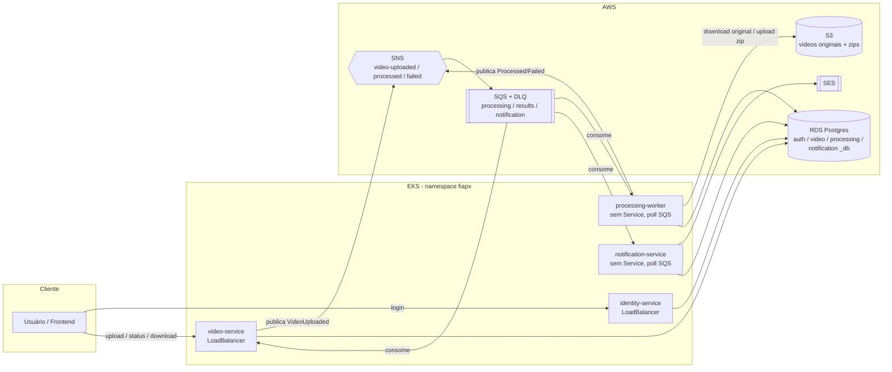
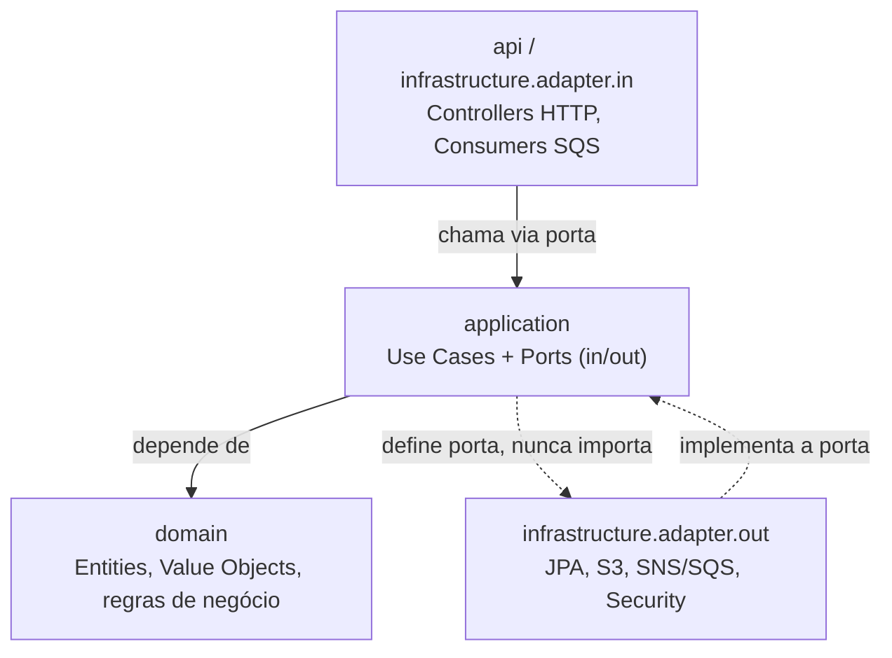

# 🎬 FIAP X - Plataforma de Processamento de Vídeo Cloud Native

Plataforma cloud-native de processamento de vídeo desenvolvida para o Hackathon FIAP X: upload de vídeo, extração assíncrona de frames e download do resultado, construída como microsserviços orientados a eventos rodando em Kubernetes na AWS.

[](https://github.com/jreigeVic/fiapx-video-processing/actions/workflows/ci.yml)
[](https://github.com/jreigeVic/fiapx-video-processing/actions/workflows/cd.yml)

---

## 📚 Sumário

- [Visão geral](#-visão-geral)
- [Arquitetura](#-arquitetura)
- [Stack tecnológica](#-stack-tecnológica)
- [Como rodar localmente](#-como-rodar-localmente)
- [Documentação](#-documentação)
- [Estrutura do repositório](#-estrutura-do-repositório)

---

## 🧭 Visão geral

Um usuário se autentica, envia um vídeo, e a plataforma processa esse vídeo de forma assíncrona (extração de frames via `ffmpeg`), notificando o resultado por e-mail. Quatro microsserviços independentes cuidam de cada responsabilidade:

| Serviço | Responsabilidade | Docs |
|---|---|---|
| 🔐 [`identity-service`](services/identity-service) | Cadastro, login, JWT | [LLD](docs/LLD/identity-service.md) |
| 🎞️ [`video-service`](services/video-service) | Upload, status, download | [LLD](docs/LLD/video-service.md) |
| ⚙️ [`processing-worker`](services/processing-worker) | Extração de frames (ffmpeg) | [LLD](docs/LLD/processing-worker.md) |
| 📧 [`notification-service`](services/notification-service) | Notificação por e-mail (SES) | [LLD](docs/LLD/notification-service.md) |

## 🏗️ Arquitetura

- Clean Architecture + Hexagonal Architecture (Ports & Adapters)
- Domain-Driven Design (lite)
- Event-Driven Architecture (Amazon SNS + SQS, Competing Consumers)
- Database per Service
- Escalabilidade horizontal via HPA (Kubernetes)

> Este repositório segue um fluxo de engenharia AI-first: decisões arquiteturais são tomadas pelos engenheiros, e a implementação repetitiva é acelerada por IA. Veja [`docs/development/workflow.md`](docs/development/workflow.md).

### Mapa do sistema

Upload é síncrono (HTTP); processamento é assíncrono (eventos). O `video-service` nunca chama o `processing-worker` diretamente — ele publica um evento, e quem processa é acordado pela fila.



### Arquitetura interna de cada serviço (Hexagonal)

Cada serviço segue as mesmas 4 camadas, verificadas automaticamente por um `HexagonalArchitectureTest.java` (ArchUnit) em todos os 4 serviços — a regra de dependência abaixo falha o build se for violada:



- **`domain`** nunca depende de Spring/JPA/DTOs — só regra de negócio pura.
- **`application`** define casos de uso e duas famílias de portas: `ports/in` (o que o serviço oferece — implementada pelo use case, consumida pelo controller/consumer) e `ports/out` (o que o serviço precisa de fora — implementada pelos adapters de infraestrutura).
- **`infrastructure`** implementa as portas de saída (JPA, S3, SNS/SQS) e contém os adapters de entrada (filtro JWT, consumers SQS).
- Mais diagramas por serviço (componentes, sequência, modelo de dados, catálogo de eventos) em [`docs/diagrams/`](docs/diagrams/).

## 🧰 Stack tecnológica

Java 21 · Spring Boot · PostgreSQL · Amazon S3/SNS/SQS · Kubernetes (EKS) · Terraform · GitHub Actions · OpenTelemetry · New Relic

## 🚀 Como rodar localmente

Pré-requisito: Docker Desktop instalado e em execução.

```bash
cp .env.example .env
docker compose up -d
```

Isso sobe **PostgreSQL** e **LocalStack** (S3/SNS/SQS emulados). Depois, rode cada microsserviço individualmente (Gradle ou sua IDE) contra esses containers. Guia completo em [`docs/setup/local-development.md`](docs/setup/local-development.md).

## 📖 Documentação

| O que você procura | Onde encontrar |
|---|---|
| 🗺️ Visão arquitetural completa (HLD) | [`docs/HLD/`](docs/HLD/README.md) |
| 🔍 Detalhes de implementação por serviço (LLD) | [`docs/LLD/`](docs/LLD/) |
| 📐 Decisões arquiteturais (ADRs) | [`docs/ADR/`](docs/ADR/README.md) |
| 🧩 Referência de API (endpoints, contratos) | [`docs/api/`](docs/api/README.md) |
| ⚙️ Setup de plataforma, CI/CD | [`docs/setup/`](docs/setup/) |
| 🧑‍💻 Fluxo de desenvolvimento, Definition of Done | [`docs/development/`](docs/development/workflow.md) |
| ✅ Rastreabilidade RF/RNF × evidências | [`docs/rf-rnf-traceability.md`](docs/rf-rnf-traceability.md) |
| 🕑 Histórico de decisões do projeto | [`docs/decision-log.md`](docs/decision-log.md) |
| 🛟 Problemas comuns e como resolver | [`docs/development/troubleshooting.md`](docs/development/troubleshooting.md) |
| 🧪 Testes de carga (k6) | [`tests/load/`](tests/load/README.md) |
| ☸️ Helm charts | [`infrastructure/helm/`](infrastructure/helm/README.md) |
| ☁️ Terraform (AWS) | [`infrastructure/`](infrastructure/README.md) |

## 📂 Estrutura do repositório

```
.
├── services/             # 4 microsserviços (Spring Boot / Java 21), build Gradle independente
│   ├── identity-service/
│   ├── video-service/
│   ├── processing-worker/
│   └── notification-service/
├── infrastructure/       # Terraform (AWS) + Helm (Kubernetes)
│   ├── terraform/        # EKS, RDS, S3, ECR, SNS/SQS, SES, dashboard New Relic
│   ├── helm/             # chart `microservice` (x4) + chart `cluster-setup`
│   ├── localstack/       # bootstrap de S3/SNS/SQS/SES para dev local e CI
│   └── docker/           # init do Postgres local (múltiplos bancos)
├── frontend/             # Demo estático (login/upload/status/download)
├── tests/load/           # Cenários de carga k6 (burst / sustained / spike)
├── docs/                 # HLD, LLD, ADRs, API, setup, desenvolvimento, diagramas
└── .github/workflows/    # CI (ci.yml) e CD (cd.yml)
```

### Estrutura interna de um microsserviço

Todos os 4 seguem o mesmo esqueleto de pacotes (`com.fiapx.<serviço>`), ilustrado aqui com o `video-service` — o mais completo, por ter tanto um controller HTTP quanto um consumer SQS:

```
com.fiapx.video
├── api/                          # DTOs e mapeamento HTTP (camada mais externa)
│   ├── controller/               # @RestController - só delega para os use cases
│   ├── request/ response/        # records de entrada/saída
│   └── mapper/                   # domain -> DTO de resposta
├── application/                  # regra de aplicação, isolada de framework
│   ├── usecase/                  # 1 classe por caso de uso (ex.: UploadVideoUseCase)
│   ├── ports/in/                 # o que o serviço oferece (implementada pelo use case)
│   ├── ports/out/                # o que o serviço precisa de fora (implementada pelo adapter)
│   └── dto/                      # objetos internos entre camadas
├── domain/                       # regra de negócio pura, zero dependência de Spring/JPA
│   ├── model/                    # entidades e value objects (ex.: Video, StorageObjectKey)
│   └── exception/                # exceções de domínio
├── infrastructure/                # implementação concreta das portas de saída + adapters de entrada
│   ├── adapter/in/                # filtro JWT (entrada HTTP)
│   ├── adapter/out/                # S3StorageAdapter, SnsEventPublisherAdapter, JPA adapters
│   ├── messaging/                  # ProcessingResultConsumer (poll SQS) + payloads de evento
│   └── repository/                 # entidades JPA + Spring Data repositories
└── configuration/                 # composition root - único lugar que liga adapter concreto a porta
```

> **Nota de transparência:** os 4 serviços não são 100% idênticos nessa última pasta. `video-service` usa `infrastructure/messaging/` (como acima); `processing-worker` e `notification-service` colocam o consumer em `infrastructure/adapter/in/messaging/`; `identity-service` não publica nem consome eventos, então seu `infrastructure/messaging/` é só um pacote vazio de scaffold. É uma divergência conhecida e já registrada em [`pendencies.md`](pendencies.md) (seção "Package Structure"), não um erro escondido.
