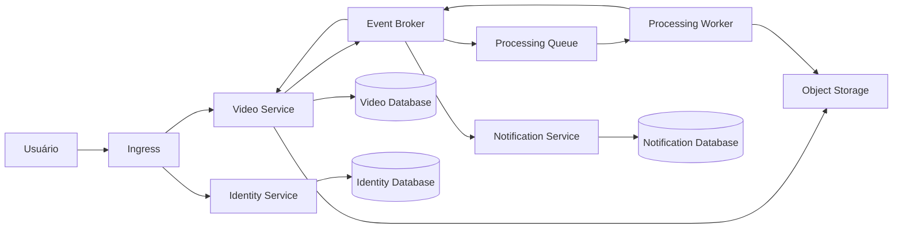

# 06 - Visão Geral da Arquitetura

## Objetivo

Este documento apresenta a visão arquitetural da plataforma **FIAP X Video Processing**, descrevendo os principais componentes da solução, seus relacionamentos e as decisões arquiteturais adotadas.

Seu objetivo é fornecer uma visão de alto nível da arquitetura antes do detalhamento dos diagramas C4, dos fluxos de eventos e da infraestrutura de implantação.

---

# Visão Geral

A solução foi concebida utilizando uma arquitetura baseada em microsserviços executados em ambiente Cloud Native.

Cada domínio de negócio é implementado por um serviço independente, responsável exclusivamente por seus próprios dados e regras de negócio.

A comunicação entre serviços ocorre prioritariamente por meio de eventos assíncronos, reduzindo o acoplamento entre componentes e permitindo evolução independente de cada domínio.

A plataforma utiliza serviços gerenciados para armazenamento de arquivos, mensageria e persistência de dados, permitindo maior disponibilidade, escalabilidade e simplificação operacional.

---

# Estilo Arquitetural

A arquitetura combina diferentes estilos arquiteturais, cada um responsável por atender necessidades específicas da solução.

| Estilo | Objetivo |
|---------|----------|
| Microsserviços | Separação de responsabilidades e evolução independente |
| Event-Driven Architecture | Comunicação desacoplada entre serviços |
| Clean Architecture | Organização das regras de negócio |
| Hexagonal Architecture | Isolamento entre domínio e infraestrutura |
| Cloud Native | Escalabilidade, automação e resiliência |
| Database per Service | Independência entre os domínios |

Esses estilos são complementares e foram selecionados para atender aos requisitos funcionais e não funcionais definidos anteriormente.

---

# Componentes da Solução

A plataforma é composta pelos seguintes componentes principais.

## Identity Service

Responsável pela autenticação e gerenciamento de usuários.

Principais responsabilidades:

- autenticação;
- autorização;
- gerenciamento de usuários;
- emissão de tokens de acesso.

---

## Video Service

Responsável pelo gerenciamento do ciclo de vida dos vídeos enviados pelos usuários.

Principais responsabilidades:

- recebimento dos uploads;
- armazenamento das informações do vídeo;
- publicação dos eventos de processamento;
- consulta de status;
- disponibilização do resultado.

---

## Processing Worker

Responsável pelo processamento assíncrono dos vídeos.

Principais responsabilidades:

- consumir eventos de processamento;
- executar o fluxo de processamento;
- publicar o resultado do processamento;
- garantir processamento resiliente.

---

## Notification Service

Responsável pelo envio de notificações relacionadas ao processamento.

Principais responsabilidades:

- consumir eventos;
- enviar notificações aos usuários;
- permitir futuras integrações com outros canais de comunicação.

---

# Serviços de Infraestrutura

A solução depende dos seguintes serviços de infraestrutura.

| Serviço | Responsabilidade |
|----------|------------------|
| Object Storage | Armazenamento dos arquivos enviados e resultados |
| Message Broker | Distribuição dos eventos da plataforma |
| Message Queue | Processamento assíncrono |
| Banco de Dados | Persistência dos dados de cada domínio |
| Kubernetes | Orquestração dos containers |

---

# Visão Arquitetural

---

# Princípios Arquiteturais

As seguintes decisões arquiteturais orientam toda a implementação da plataforma.

## Responsabilidade Única

Cada microsserviço possui um domínio claramente definido.

---

## Baixo Acoplamento

Serviços comunicam-se preferencialmente através de eventos.

---

## Banco por Serviço

Cada domínio possui sua própria persistência.

Nenhum serviço acessa diretamente o banco de dados de outro domínio.

---

## Processamento Assíncrono

Operações demoradas são desacopladas da interação direta com o usuário.

---

## Evolução Independente

Cada serviço pode evoluir, ser implantado e escalado independentemente dos demais.

---

# Rastreabilidade

As decisões apresentadas neste documento são detalhadas nas próximas seções do High Level Design:

- C4 Context Diagram;
- C4 Container Diagram;
- Arquitetura Orientada a Eventos;
- Arquitetura de Implantação;
- Estratégia de Segurança;
- Estratégia de Observabilidade;
- Estratégia de Escalabilidade.

Além disso, cada decisão arquitetural possui rastreabilidade para suas respectivas ADRs e para os documentos de Low Level Design dos microsserviços.