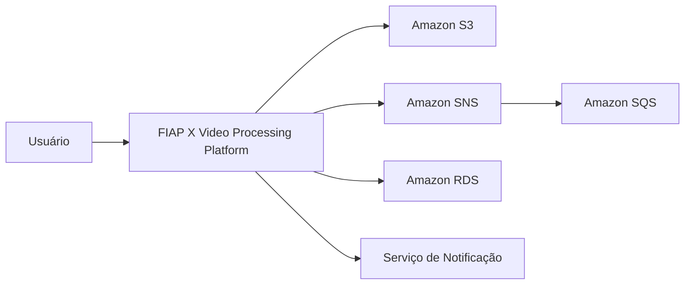

# 07 - Diagrama de Contexto C4

## Objetivo

Este documento apresenta o diagrama de contexto (C4 Model – Nível 1) da plataforma **FIAP X Video Processing**.

O diagrama identifica os principais atores externos, sistemas integrados e o limite da solução, permitindo compreender como a plataforma se posiciona dentro do ecossistema.

O objetivo é fornecer uma visão macro das interações externas antes do detalhamento dos containers e componentes internos da solução.

---

# Contexto da Solução

A plataforma é consumida por usuários autenticados que enviam vídeos para processamento.

Durante o processamento, a solução interage com serviços gerenciados da AWS responsáveis pelo armazenamento dos arquivos, mensageria e persistência dos dados.

Essas integrações permitem que o processamento ocorra de forma distribuída, resiliente e desacoplada.

---

# C4 - Diagrama de Contexto

---

# Atores

## Usuário

Responsável por:

- autenticar-se;
- enviar vídeos;
- acompanhar o processamento;
- realizar download dos resultados.

---

# Sistemas Externos

| Sistema | Responsabilidade |
|----------|------------------|
| Amazon S3 | Armazenamento dos vídeos e resultados |
| Amazon SNS | Distribuição de eventos |
| Amazon SQS | Processamento assíncrono |
| Amazon RDS | Persistência dos dados |
| Serviço de Notificação | Comunicação com o usuário |

---

# Limite da Plataforma

A plataforma é responsável por coordenar todo o ciclo de processamento dos vídeos.

Serviços externos são utilizados exclusivamente como infraestrutura de apoio, mantendo as regras de negócio encapsuladas nos microsserviços da aplicação.

---

# Considerações

Este diagrama representa apenas as interações externas da solução.

Os detalhes internos da arquitetura serão apresentados no **Container Diagram (C4 Nível 2)**, descrito no próximo documento.