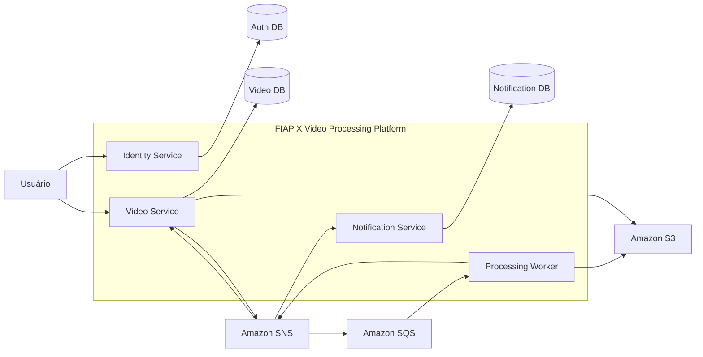

# 08 - Diagrama de Container C4

## Objetivo

Este documento apresenta o **Container Diagram (C4 Model – Nível 2)** da plataforma **FIAP X Video Processing**.

O objetivo é demonstrar como a solução foi organizada internamente, evidenciando seus principais containers, responsabilidades, relacionamentos e integrações com serviços externos.

Este nível do modelo C4 descreve a arquitetura da aplicação sem entrar nos detalhes internos de implementação de cada microsserviço.

---

# Visão Geral

A plataforma é composta por um conjunto de microsserviços independentes, responsáveis por domínios específicos do negócio.

Cada serviço possui responsabilidade única, persistência própria e comunicação baseada em eventos.

Essa organização reduz o acoplamento entre componentes e permite evolução, implantação e escalabilidade independentes.

---

# Containers da Plataforma

## Identity Service

Responsável pela autenticação, autorização e gerenciamento dos usuários da plataforma.

### Responsabilidades

- autenticação;
- emissão de tokens;
- gerenciamento de usuários;
- autorização de acesso.

---

## Video Service

Responsável pelo gerenciamento do ciclo de vida dos vídeos.

### Responsabilidades

- receber uploads;
- armazenar informações do vídeo;
- consultar status;
- disponibilizar resultados;
- publicar eventos de processamento.

---

## Processing Worker

Responsável pelo processamento assíncrono dos vídeos.

### Responsabilidades

- consumir eventos;
- processar arquivos;
- publicar novos eventos;
- garantir resiliência durante o processamento.

---

## Notification Service

Responsável pelas notificações aos usuários.

### Responsabilidades

- consumir eventos;
- enviar notificações;
- suportar futuras integrações.

---

# Serviços Compartilhados

A plataforma utiliza serviços gerenciados para suportar operações específicas.

| Serviço | Objetivo |
|----------|----------|
| Amazon S3 | Armazenamento dos arquivos |
| Amazon SNS | Distribuição dos eventos |
| Amazon SQS | Processamento assíncrono |
| Amazon RDS | Persistência dos dados |

---

# Diagrama de Container

---

# Comunicação entre Containers

A comunicação entre os componentes segue dois modelos distintos.

## Comunicação síncrona

Utilizada exclusivamente para requisições iniciadas pelo usuário.

Exemplos:

- autenticação;
- upload;
- consulta de status;
- download.

---

## Comunicação assíncrona

Utilizada para processamento interno da plataforma.

Exemplos:

- início do processamento;
- conclusão do processamento;
- falhas;
- notificações.

---

# Responsabilidades Arquiteturais

Cada container é responsável exclusivamente pelo próprio domínio de negócio.

Como consequência:

- nenhum serviço acessa diretamente o banco de outro serviço;
- comunicação ocorre preferencialmente por eventos;
- cada domínio pode evoluir de forma independente;
- a escalabilidade ocorre individualmente por serviço.

---

# Considerações

Este documento apresenta apenas a organização lógica da plataforma.

Os detalhes do fluxo de comunicação baseado em eventos serão apresentados na próxima seção do High Level Design.