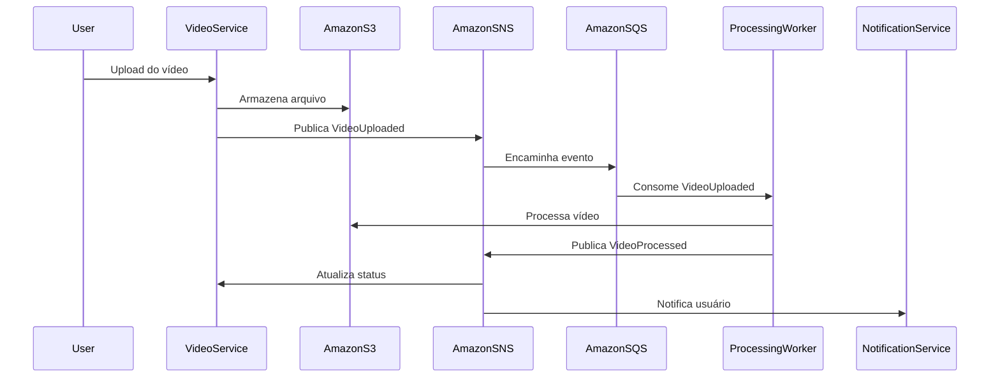
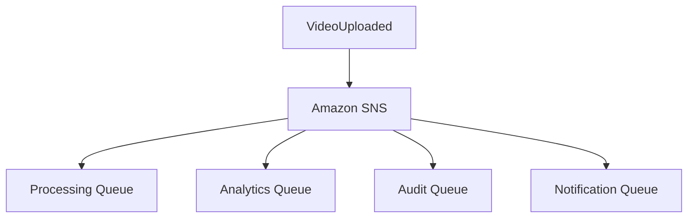

# 09 - Event-Driven Architecture

## Objetivo

Este documento descreve a arquitetura orientada a eventos adotada pela plataforma **FIAP X Video Processing**.

Seu objetivo é apresentar como os microsserviços se comunicam de forma assíncrona, desacoplada e resiliente, reduzindo dependências diretas entre componentes e permitindo evolução independente dos domínios da aplicação.

A comunicação baseada em eventos constitui um dos principais pilares arquiteturais da solução.

---

# Motivação

O processamento de vídeos é uma operação naturalmente intensiva em recursos computacionais e pode demandar um tempo significativo para sua conclusão.

Executar esse processamento de forma síncrona aumentaria o tempo de resposta percebido pelo usuário, reduziria a capacidade de escalabilidade da plataforma e elevaria o acoplamento entre seus componentes.

Para atender aos requisitos de escalabilidade, disponibilidade e resiliência definidos neste High Level Design, foi adotada uma arquitetura orientada a eventos.

Nessa abordagem, o usuário recebe uma resposta imediata após o envio do vídeo, enquanto todo o processamento ocorre de forma assíncrona em segundo plano.

---

# Fluxo Geral

O processamento de um vídeo segue o fluxo descrito abaixo.

1. O usuário realiza o upload do vídeo.
2. O vídeo é armazenado no serviço de armazenamento.
3. O Video Service publica um evento indicando que o vídeo está disponível para processamento.
4. O Processing Worker consome esse evento.
5. O processamento é executado.
6. Um novo evento é publicado informando o resultado do processamento.
7. Os serviços interessados reagem ao evento de acordo com suas responsabilidades.

---

# Fluxo de Eventos

---

# Eventos Publicados

## VideoUploaded

Representa que um novo vídeo foi recebido e está disponível para processamento.

**Publicado por**

- Video Service

**Consumido por**

- Processing Worker

---

## VideoProcessed

Representa a conclusão bem-sucedida do processamento.

**Publicado por**

- Processing Worker

**Consumido por**

- Video Service
- Notification Service

---

## VideoFailed

Representa que ocorreu uma falha durante o processamento.

**Publicado por**

- Processing Worker

**Consumido por**

- Video Service
- Notification Service

---

# Estratégia de Comunicação

A comunicação entre os microsserviços segue o modelo **Publish/Subscribe**, utilizando eventos como principal mecanismo de integração.

Nesse modelo, os serviços produtores conhecem apenas o evento que será publicado, permanecendo completamente desacoplados dos consumidores responsáveis pelo seu processamento.

Essa abordagem permite:

- redução do acoplamento entre domínios;
- evolução independente dos microsserviços;
- inclusão de novos consumidores sem alterações no produtor;
- maior resiliência operacional;
- escalabilidade horizontal da plataforma.

---

# Ownership dos Dados

A arquitetura adota o princípio **Database per Service**, no qual cada microsserviço é proprietário exclusivo dos dados pertencentes ao seu domínio.

Nenhum serviço realiza escrita direta no banco de dados pertencente a outro domínio.

Durante o processamento dos vídeos, por exemplo, o **Processing Worker** não atualiza diretamente os registros mantidos pelo **Video Service**.

Ao concluir o processamento, o Worker publica um novo evento informando o resultado da operação.

O próprio **Video Service**, ao consumir esse evento, torna-se responsável por atualizar o estado do processamento em seu banco de dados.

Essa estratégia preserva a autonomia entre os domínios, reduz o acoplamento entre serviços e mantém a consistência arquitetural da plataforma.

---

# Fan-out de Eventos

A utilização do Amazon SNS permite que um único evento seja distribuído para múltiplos consumidores de forma transparente.

Essa característica possibilita a evolução incremental da solução, permitindo a inclusão de novos serviços sem necessidade de alterações no produtor do evento.

Embora o MVP utilize apenas a fila responsável pelo processamento dos vídeos, a arquitetura suporta naturalmente a adição de novos consumidores especializados.

---

# Garantias Arquiteturais

A arquitetura orientada a eventos foi projetada para assegurar os seguintes atributos de qualidade:

- baixo acoplamento entre serviços;
- processamento assíncrono;
- escalabilidade independente;
- tolerância a falhas;
- possibilidade de reprocessamento;
- evolução incremental da plataforma;
- isolamento entre domínios de negócio.

---

# Tratamento de Falhas

Durante o processamento dos eventos, a plataforma adota mecanismos para reduzir impactos operacionais e preservar a consistência da solução.

Entre as estratégias previstas destacam-se:

- novas tentativas automáticas de processamento;
- utilização de Dead Letter Queue (DLQ) para mensagens não processadas;
- operações idempotentes para evitar processamento duplicado;
- isolamento das falhas em um único domínio, impedindo propagação para os demais serviços.

Essa abordagem aumenta significativamente a resiliência da plataforma e reduz riscos de perda de processamento.

---

# Evolução da Arquitetura

A arquitetura foi concebida para permitir evolução contínua sem necessidade de alterações estruturais nos serviços existentes.

Exemplos de novos consumidores que poderão ser adicionados futuramente:

- Analytics Service;
- Audit Service;
- Thumbnail Service;
- Recommendation Service;
- Machine Learning Service;
- Novos canais de notificação.

Todos esses componentes poderão consumir os mesmos eventos já publicados pela plataforma, preservando o baixo acoplamento e a independência entre domínios.

---

# Considerações

A arquitetura orientada a eventos representa um dos principais pilares da plataforma **FIAP X Video Processing**, atendendo diretamente aos atributos de qualidade definidos neste High Level Design.

As decisões apresentadas neste documento estabelecem a base para o detalhamento dos contratos de eventos, responsabilidades dos microsserviços e estratégias de processamento descritas posteriormente no Low Level Design.