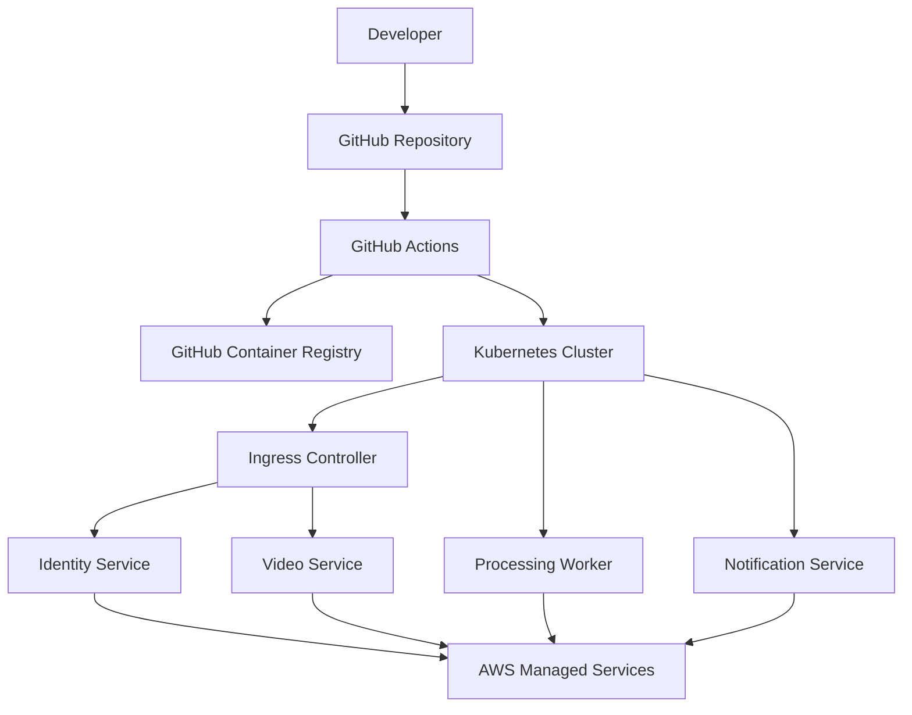

# 10 - Arquitetura de Implantação

## Objetivo

Este documento apresenta a arquitetura de implantação da plataforma **FIAP X Video Processing**, descrevendo como os componentes da solução são distribuídos na infraestrutura Cloud Native.

São apresentados os principais recursos de infraestrutura, a estratégia de implantação dos microsserviços e o relacionamento entre os componentes responsáveis pela execução da aplicação.

---

# Visão Geral

A plataforma é implantada em ambiente Kubernetes utilizando infraestrutura provisionada como código.

Todos os microsserviços são executados em containers independentes e podem ser implantados, escalados e atualizados individualmente.

Os serviços de infraestrutura utilizados são providos pela AWS, reduzindo o esforço operacional e aumentando a disponibilidade da plataforma.

---

# Componentes da Infraestrutura

A infraestrutura da solução é composta pelos seguintes componentes.

| Componente | Responsabilidade |
|------------|------------------|
| GitHub | Repositório do código-fonte |
| GitHub Actions | Pipeline de Integração e Entrega Contínua |
| GitHub Container Registry | Armazenamento das imagens Docker |
| Kubernetes Cluster | Orquestração dos containers |
| Ingress Controller | Exposição dos serviços HTTP |
| Amazon S3 | Armazenamento dos arquivos enviados e processados |
| Amazon SNS | Publicação de eventos |
| Amazon SQS | Processamento assíncrono |
| Amazon RDS | Persistência dos dados |
| CloudWatch | Monitoramento da infraestrutura |

---

# Arquitetura de Implantação

---

# Organização da Plataforma

Os microsserviços são implantados de forma independente.

Cada serviço possui:

- imagem Docker própria;
- configuração própria;
- ciclo de deploy independente;
- escalabilidade individual.

Essa organização reduz impactos durante novas implantações e facilita a evolução da plataforma.

---

# Estratégia de Implantação

A solução utiliza uma estratégia baseada em containers.

O fluxo de implantação ocorre da seguinte forma:

1. O desenvolvedor envia alterações para o repositório.
2. A pipeline automatizada realiza validações.
3. A imagem do serviço é construída.
4. A imagem é publicada no registry.
5. O Kubernetes realiza a atualização dos serviços.
6. Novas réplicas passam a receber tráfego após validação de disponibilidade.

---

# Estratégia de Alta Disponibilidade

Para aumentar a disponibilidade da solução são adotadas as seguintes estratégias:

- múltiplas réplicas dos microsserviços;
- serviços stateless;
- atualização gradual dos containers;
- reinício automático em caso de falhas;
- desacoplamento entre processamento e interface do usuário.

---

# Escalabilidade da Infraestrutura

Cada microsserviço pode crescer independentemente dos demais.

O processamento assíncrono permite que o Worker seja escalado conforme a demanda sem necessidade de aumentar os demais serviços.

Essa abordagem reduz custos computacionais e melhora a utilização dos recursos da plataforma.

---

# Infraestrutura como Código

Toda a infraestrutura da solução é descrita utilizando Infraestrutura como Código (IaC).

Essa abordagem garante:

- reprodutibilidade dos ambientes;
- padronização da infraestrutura;
- versionamento das alterações;
- facilidade para criação de novos ambientes.

---

# Considerações

A arquitetura de implantação foi concebida para suportar crescimento contínuo da plataforma, permitindo evolução incremental dos microsserviços sem comprometer disponibilidade, escalabilidade ou segurança.

Os detalhes de provisionamento dos recursos serão apresentados posteriormente na documentação de infraestrutura e nos artefatos de Terraform e Kubernetes.