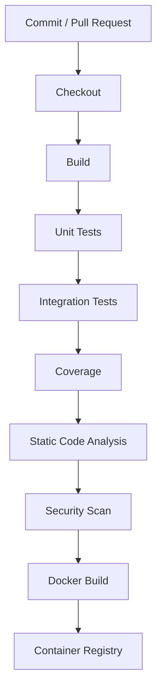
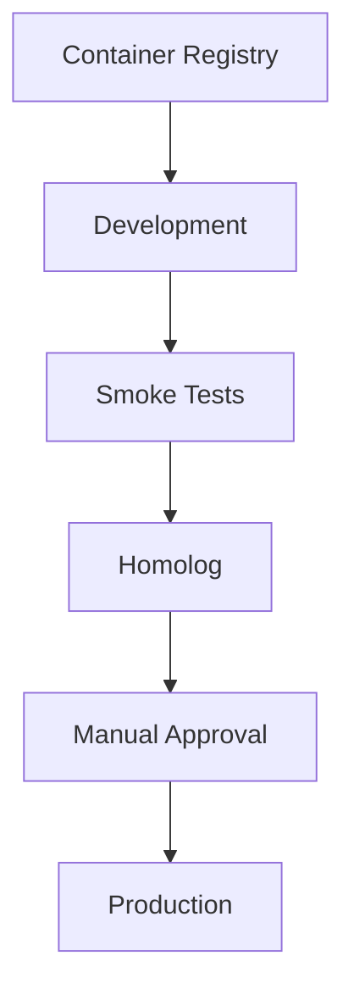

# 14 - Continuous Integration and Continuous Delivery (CI/CD)

## Objetivo

Este documento apresenta a estratégia de Integração Contínua e Entrega Contínua (CI/CD) adotada pela plataforma **FIAP X Video Processing**.

Seu objetivo é garantir que todo o ciclo de desenvolvimento, validação e implantação da aplicação seja automatizado, reproduzível e seguro, reduzindo atividades manuais e aumentando a confiabilidade das entregas.

---

# Visão Geral

A plataforma adota uma estratégia baseada em pipelines automatizadas para validação da qualidade do código, construção dos artefatos da aplicação e implantação da infraestrutura.

A automação reduz riscos operacionais, acelera a entrega de novas funcionalidades e garante que todas as alterações passem pelos mesmos critérios de qualidade antes da implantação.

---

# Estratégia de Integração Contínua

Sempre que uma alteração é enviada ao repositório, uma pipeline de Integração Contínua é iniciada automaticamente.

Essa pipeline é responsável por validar a qualidade da aplicação antes da geração dos artefatos de implantação.

Entre as principais atividades executadas destacam-se:

- restauração das dependências do projeto;
- compilação da aplicação;
- execução dos testes automatizados;
- geração da cobertura de testes;
- análise estática de código;
- análise de vulnerabilidades;
- construção da imagem do container.

---

# Pipeline de Integração Contínua

---

# Estratégia de Entrega Contínua

Após a conclusão da pipeline de Integração Contínua, a aplicação torna-se apta para implantação.

A estratégia de entrega contempla ambientes independentes, permitindo validações progressivas antes da disponibilização da aplicação.

---

# Pipeline de Entrega

---

# Qualidade da Pipeline

A pipeline executa automaticamente verificações relacionadas à qualidade do software.

Entre elas destacam-se:

- testes automatizados;
- cobertura mínima de código;
- análise estática;
- detecção de vulnerabilidades;
- validação da construção da aplicação.

Somente artefatos aprovados em todas as etapas podem seguir para implantação.

---

# Segurança da Pipeline

A estratégia de CI/CD considera mecanismos para proteger o processo de entrega da aplicação.

Entre eles:

- autenticação segura entre plataforma de CI e ambiente Cloud;
- gerenciamento seguro de credenciais;
- versionamento das imagens de container;
- rastreabilidade das implantações.

---

# Implantação da Aplicação

Os microsserviços são implantados individualmente.

Cada serviço possui:

- pipeline própria;
- imagem independente;
- versionamento independente;
- ciclo de implantação independente.

Essa abordagem reduz impactos entre domínios e facilita a evolução da plataforma.

---

# Ferramentas Adotadas

| Ferramenta | Objetivo |
|------------|----------|
| GitHub | Versionamento do código-fonte |
| GitHub Actions | Automação das pipelines |
| Gradle | Build da aplicação |
| JaCoCo | Cobertura de testes |
| SonarQube Cloud | Análise de qualidade |
| Trivy | Análise de vulnerabilidades |
| Docker | Empacotamento da aplicação |
| Amazon ECR | Armazenamento das imagens (Epic 010 - `infrastructure/terraform/ecr.tf`; GHCR foi a opção original considerada, mas ECR é o registry provisionado de fato) |
| Kubernetes | Implantação dos microsserviços |

---

# Benefícios

A estratégia de CI/CD proporciona diversos benefícios para o ciclo de desenvolvimento.

Entre eles destacam-se:

- redução de erros manuais;
- padronização do processo de entrega;
- maior confiabilidade das implantações;
- feedback rápido para os desenvolvedores;
- maior segurança durante o processo de publicação;
- facilidade para evolução contínua da plataforma.

---

# Considerações

A automação do processo de integração e entrega contínua representa um dos pilares da estratégia DevOps adotada pela plataforma.

A utilização de pipelines automatizadas garante maior qualidade das entregas, reduz riscos operacionais e facilita a evolução contínua da solução.