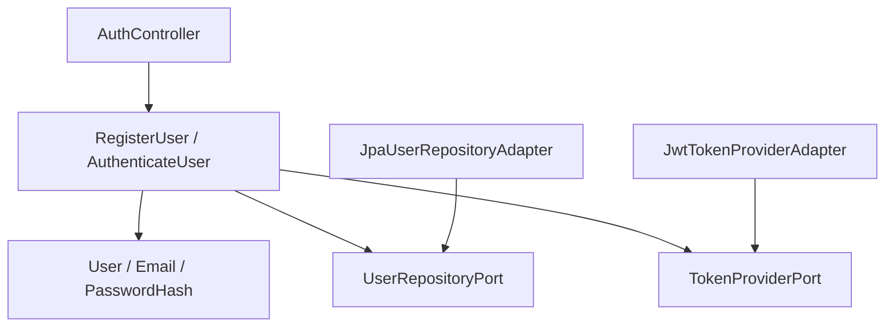
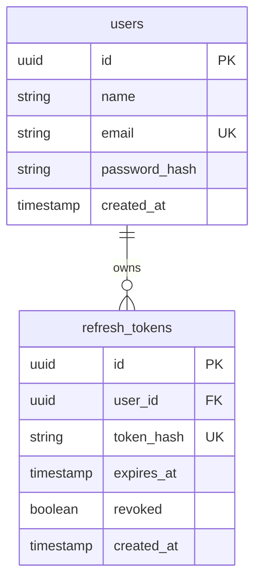
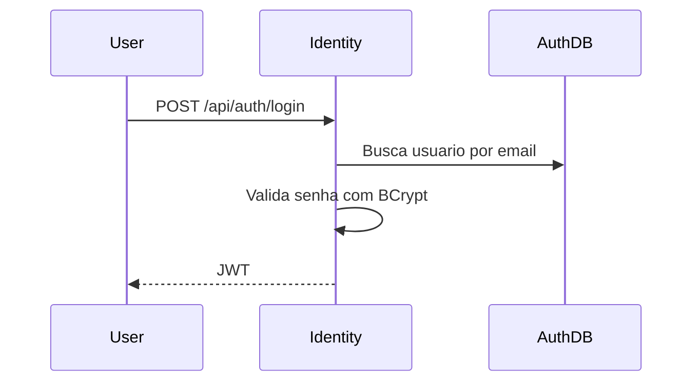

# Identity Service LLD

## Objetivo

Implementar autenticacao, autorizacao e gerenciamento basico de usuarios da plataforma FIAP X Video Processing.

## Responsabilidades

- Registrar usuarios.
- Autenticar credenciais.
- Armazenar senhas com BCrypt.
- Emitir JWT.
- Disponibilizar informacoes do usuario autenticado quando necessario.

## Limites do Dominio

Pertence ao Identity Service:

- Usuario.
- Credencial.
- Token de acesso.
- Politicas de autenticacao.

Nao pertence ao Identity Service:

- Upload de videos.
- Status de processamento.
- Processamento de arquivos.
- Notificacoes de conclusao ou falha.

## Rastreabilidade

| Origem | Aplicacao neste LLD |
|--------|----------------------|
| HLD 06 - Architecture Overview | Microservico Identity. |
| HLD 11 - Security | JWT, Spring Security, BCrypt. |
| ADR-011 | Naming conventions and package organization. |

## Casos de Uso

| Caso de uso | Descricao |
|-------------|-----------|
| RegisterUser | Cria usuario com email e senha criptografada. |
| AuthenticateUser | Valida credenciais e emite JWT + refresh token. |
| GetAuthenticatedUser | Retorna dados basicos do usuario autenticado. |
| RefreshToken | Troca um refresh token valido por um novo par access/refresh token (rotacao). |
| Logout | Revoga um refresh token especifico. |

## Arquitetura Interna



## Organizacao dos Pacotes

Consultar ADR-011 para detalhes completos.

```text
com.fiapx.identity
  application.usecase
  application.port
  domain.model
  domain.valueobject
  domain.exception
  infrastructure.adapter.in.web
  infrastructure.adapter.out.persistence
  infrastructure.adapter.out.security
  infrastructure.config
  api.controller
  api.request
  api.response
  shared.error
```

## Entidades

### User

| Campo | Tipo | Regra |
|-------|------|-------|
| id | UUID | Identificador do usuario. |
| name | String | Nome informado no cadastro. |
| email | Email | Unico no auth_db. |
| passwordHash | PasswordHash | Senha criptografada com BCrypt. |
| createdAt | Instant | Data de criacao. |

### RefreshToken

| Campo | Tipo | Regra |
|-------|------|-------|
| id | UUID | Identificador do refresh token. |
| userId | UUID | Usuario dono do token. |
| tokenHash | String | Hash do valor opaco do token; o valor puro nunca e persistido. |
| expiresAt | Instant | Expiracao do token. |
| revoked | boolean | Marcado true no logout ou na rotacao. |
| createdAt | Instant | Data de criacao. |

## Value Objects

| Value Object | Regra |
|--------------|-------|
| Email | Formato valido e normalizacao para comparacao. |
| PasswordHash | Representa senha ja criptografada, nunca senha pura. |

## DTOs

| DTO | Campos |
|-----|--------|
| RegisterUserRequest | name, email, password |
| UserResponse | id, name, email |
| LoginRequest | email, password |
| LoginResponse | accessToken, tokenType, expiresIn, refreshToken |
| RefreshTokenRequest | refreshToken |
| LogoutRequest | refreshToken |

## Controllers

| Metodo | Endpoint | Uso |
|--------|----------|-----|
| POST | /api/auth/register | Cadastro de usuario. |
| POST | /api/auth/login | Autenticacao e emissao de JWT + refresh token. |
| GET | /api/auth/me | Dados do usuario autenticado. |
| POST | /api/auth/refresh | Rotaciona um refresh token valido por um novo par de tokens. |
| POST | /api/auth/logout | Revoga um refresh token (endpoint protegido). |

## Use Cases

### RegisterUser

1. Validar entrada.
2. Verificar se email ja existe.
3. Criptografar senha com BCrypt.
4. Persistir usuario em auth_db.
5. Retornar dados publicos do usuario.

### AuthenticateUser

1. Buscar usuario por email.
2. Comparar senha com BCrypt.
3. Gerar JWT (access token).
4. Gerar e persistir (hash) um refresh token.
5. Retornar access token e refresh token.

### RefreshToken

1. Buscar refresh token pelo hash do valor recebido.
2. Validar que existe, nao esta revogado e nao expirou.
3. Revogar o refresh token usado (rotacao).
4. Gerar novo access token e novo refresh token.
5. Retornar o novo par de tokens.

### Logout

1. Buscar refresh token pelo hash do valor recebido.
2. Marcar como revogado se pertencer ao usuario autenticado.

## Ports

| Port | Direcao | Responsabilidade |
|------|---------|------------------|
| RegisterUserUseCase | Inbound | Cadastro de usuario. |
| AuthenticateUserUseCase | Inbound | Autenticacao. |
| RefreshTokenUseCase | Inbound | Rotacao de refresh token. |
| LogoutUseCase | Inbound | Revogacao de refresh token. |
| UserRepositoryPort | Outbound | Persistencia de usuarios. |
| PasswordEncoderPort | Outbound | Hash e verificacao de senha. |
| TokenProviderPort | Outbound | Geracao e validacao de JWT. |
| RefreshTokenRepositoryPort | Outbound | Persistencia e consulta de refresh tokens. |

## Adapters

| Adapter | Tipo | Responsabilidade |
|---------|------|------------------|
| AuthController | Inbound HTTP | Expor autenticacao. |
| JwtAuthenticationFilter | Inbound security | Validar Bearer token em recursos protegidos. |
| JpaUserRepositoryAdapter | Outbound persistence | Persistir usuarios. |
| JpaRefreshTokenRepositoryAdapter | Outbound persistence | Persistir e consultar refresh tokens. |
| BCryptPasswordEncoderAdapter | Outbound security | Hash de senha. |
| JwtTokenProviderAdapter | Outbound security | JWT. |

## Repositorios

| Repositorio | Banco | Operacoes |
|-------------|-------|-----------|
| UserRepository | auth_db | save, findByEmail, existsByEmail, findById |
| RefreshTokenRepository | auth_db | save, findByTokenHash, revoke |

## Eventos Publicados

Nenhum evento obrigatorio definido no HLD para o Identity Service.

## Eventos Consumidos

Nenhum evento obrigatorio definido no HLD para o Identity Service.

## Modelo de Dados



## Fluxos

### Login



## Estrategia de Tratamento de Erros

| Erro | Resposta |
|------|----------|
| Email ja cadastrado | 409 CONFLICT |
| Credenciais invalidas | 401 UNAUTHORIZED |
| Refresh token invalido, revogado ou expirado | 401 UNAUTHORIZED |
| Requisicao invalida | 400 BAD REQUEST |

## Estrategia de Testes

- Unit tests para RegisterUser e AuthenticateUser.
- Unit tests para validacao de Email.
- Integration tests para persistencia com PostgreSQL via Testcontainers.
- Tests de seguranca para acesso sem token em `/api/auth/me`.

## Dependencias

- Spring Boot 3.x.
- Spring Security.
- BCrypt.
- PostgreSQL.
- Flyway.
- OpenTelemetry.

## Consideracoes

Refresh Token e Logout fazem parte do escopo obrigatorio deste LLD (ver ADR-013). Escopo minimo: rotacao de refresh token a cada uso e revogacao individual via logout. Revogacao em massa de sessoes, listagem de sessoes ativas e blacklist de access token estao fora de escopo.
