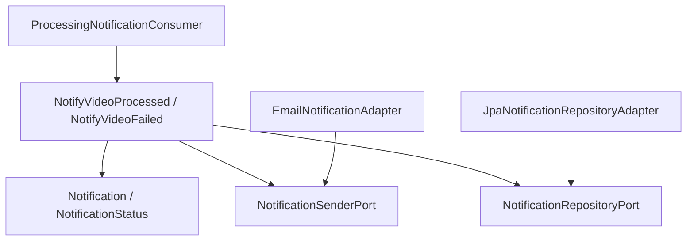
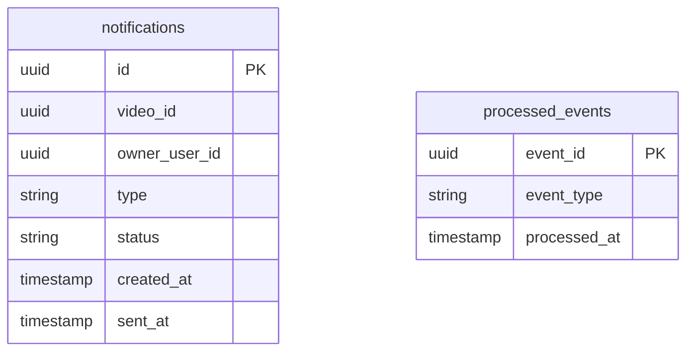
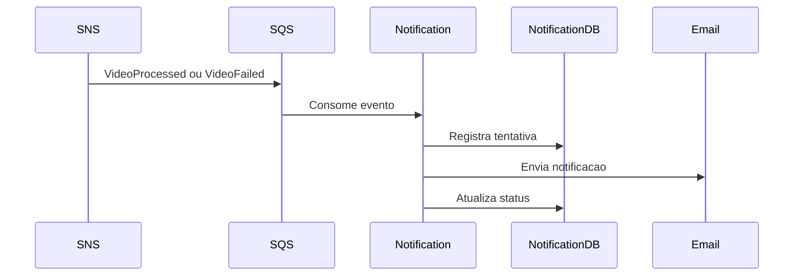

# Notification Service LLD

## Objetivo

Consumir eventos de resultado do processamento e enviar notificacoes ao usuario quando o video for processado ou falhar.

## Rastreabilidade

| Origem | Aplicacao neste LLD |
|--------|----------------------|
| HLD 06 - Architecture Overview | Microservico Notification. |
| HLD 09 - Event-Driven Architecture | Consumo de VideoProcessed e VideoFailed. |
| ADR-011 | Naming conventions and package organization. |

## Responsabilidades

- Consumir VideoProcessed.
- Consumir VideoFailed.
- Enviar notificacoes de conclusao ou falha.
- Registrar resultado de envio no notification_db.
- Manter baixo acoplamento com Video Service e Processing Worker.

## Limites do Dominio

Pertence ao Notification Service:

- Notificacao.
- Tentativa de envio.
- Preferencia operacional de canal quando existir no proprio dominio.

Nao pertence ao Notification Service:

- Processar videos.
- Alterar status do video.
- Autenticar usuarios.
- Acessar video_db ou auth_db.

## Requisitos Atendidos

| Requisito | Atendimento |
|-----------|-------------|
| RF-07 | Notificacoes de conclusao ou falha. |
| RNF-07 | Baixo acoplamento por eventos. |
| RNF-05 | Logs e metricas de notificacao. |

## Casos de Uso

| Caso de uso | Descricao |
|-------------|-----------|
| NotifyVideoProcessed | Envia notificacao de sucesso. |
| NotifyVideoFailed | Envia notificacao de falha. |
| RegisterNotificationAttempt | Registra tentativa de notificacao no notification_db. |

## Arquitetura Interna



## Organizacao dos Pacotes

Consultar ADR-011 para detalhes completos.

```text
com.fiapx.notification
  application.usecase
  application.ports.in
  application.ports.out
  domain.model
  domain.valueobject
  domain.exception
  infrastructure.adapter.in.messaging
  infrastructure.adapter.in.web
  infrastructure.adapter.out.notification
  infrastructure.adapter.out.persistence
  infrastructure.config
  api.controller
  shared.error
```

## Entidades

### Notification

| Campo | Tipo | Regra |
|-------|------|-------|
| id | UUID | Identificador da notificacao. |
| videoId | UUID | Video relacionado. |
| ownerUserId | UUID | Usuario destinatario. |
| type | NotificationType | VIDEO_PROCESSED ou VIDEO_FAILED. |
| status | NotificationStatus | PENDING, SENT, FAILED. |
| createdAt | Instant | Criacao. |
| sentAt | Instant | Envio quando houver. |

## Value Objects

| Value Object | Regra |
|--------------|-------|
| NotificationType | Tipos derivados dos eventos VideoProcessed e VideoFailed. |
| NotificationStatus | Estado da tentativa de envio. |
| Recipient | Destinatario da notificacao quando informado pelo evento ou resolvido por fonte permitida. |

## DTOs

| DTO | Origem |
|-----|--------|
| VideoProcessedEvent | Evento consumido. |
| VideoFailedEvent | Evento consumido. |
| NotificationDispatchCommand | Dados internos para envio de notificacao. |

## Controllers

Nao ha endpoint HTTP de negocio definido para o Notification Service no HLD. A entrada principal do servico e por eventos recebidos via SQS.

## Use Cases

### NotifyVideoProcessed

1. Consumir VideoProcessed.
2. Validar idempotencia.
3. Criar notificacao de sucesso.
4. Enviar notificacao.
5. Registrar status de envio no notification_db.

### NotifyVideoFailed

1. Consumir VideoFailed.
2. Validar idempotencia.
3. Criar notificacao de falha.
4. Enviar notificacao.
5. Registrar status de envio no notification_db.

## Ports

| Port | Direcao | Responsabilidade |
|------|---------|------------------|
| NotifyVideoProcessedUseCase | Inbound | Reagir a sucesso. |
| NotifyVideoFailedUseCase | Inbound | Reagir a falha. |
| NotificationSenderPort | Outbound | Enviar notificacao. |
| NotificationRepositoryPort | Outbound | Persistir historico quando aplicavel. |
| NotificationIdempotencyPort | Outbound | Evitar notificacao duplicada. |

## Adapters

| Adapter | Tipo | Responsabilidade |
|---------|------|------------------|
| ProcessingNotificationConsumer | Inbound messaging | Consumir VideoProcessed e VideoFailed. |
| EmailNotificationAdapter | Outbound notification | Enviar email ou canal aprovado. |
| JpaNotificationRepositoryAdapter | Outbound persistence | Persistir notificacoes no notification_db. |

## Repositorios

| Repositorio | Banco | Operacoes |
|-------------|-------|-----------|
| NotificationRepository | notification_db | save, findByOwnerUserId |
| ProcessedEventRepository | notification_db | existsByEventId, saveProcessedEvent |

## Eventos Publicados

Nenhum evento obrigatorio definido no HLD para o Notification Service.

## Eventos Consumidos

| Evento | Acao |
|--------|------|
| VideoProcessed | Enviar notificacao de sucesso. |
| VideoFailed | Enviar notificacao de falha. |

## Modelo de Dados



## Fluxos



## Estrategia de Tratamento de Erros

| Erro | Acao |
|------|------|
| Evento duplicado | Ignorar com log. |
| Falha temporaria de envio | Permitir retry via SQS. |
| Falha definitiva | Registrar FAILED no notification_db. |
| Excedeu tentativas | Mensagem deve ir para DLQ. |

## Estrategia de Testes

- Unit tests para NotifyVideoProcessed e NotifyVideoFailed.
- Testes de idempotencia.
- Integration tests com SQS via LocalStack.
- Integration tests de persistencia com Testcontainers para notification_db.

## Dependencias

- Spring Boot 3.x.
- Amazon SQS.
- PostgreSQL.
- OpenTelemetry.

## Consideracoes

Este LLD documenta o Notification Service como microsservico, conforme o escopo da TASK-001 e os containers definidos no HLD.
