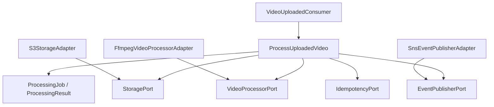
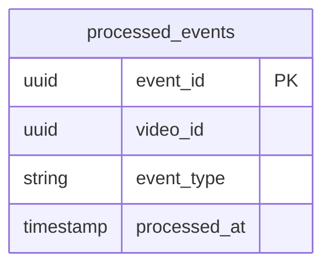
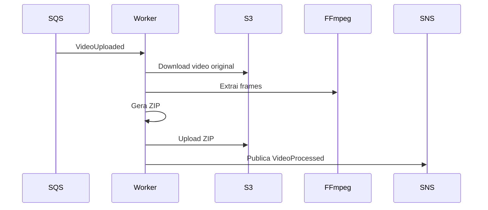

# LLD - Processing Worker

## Objetivo

Executar o processamento assincrono dos videos, extraindo frames, gerando arquivo ZIP, armazenando o resultado no Amazon S3 e publicando o resultado por eventos.

## Rastreabilidade

| Origem | Aplicacao neste LLD |
|--------|----------------------|
| HLD 06 - Architecture Overview | Microservico Processing Worker. |
| HLD 09 - Event-Driven Architecture | Consumo de VideoUploaded, publicacao de VideoProcessed e VideoFailed. |
| ADR-011 | Convencoes de nomenclatura e organizacao de pacotes. |

## Responsabilidades

- Consumir VideoUploaded por SQS.
- Baixar o video original do S3.
- Processar o video com FFmpeg.
- Gerar ZIP com frames extraidos.
- Enviar ZIP para S3.
- Publicar VideoProcessed em caso de sucesso.
- Publicar VideoFailed em caso de falha.
- Garantir idempotencia de processamento.

## Limites do Dominio

Pertence ao Processing Worker:

- Execucao do processamento.
- Controle operacional de idempotencia do processamento.
- Publicacao de resultado.

Nao pertence ao Processing Worker:

- Atualizar video_db.
- Decidir status persistido do Video Service.
- Autenticar usuarios.
- Notificar usuarios diretamente.

## Requisitos Atendidos

| Requisito | Atendimento |
|-----------|-------------|
| RF-04 | Processamento assincrono. |
| RF-08 | Publicacao de eventos de resultado. |
| RF-09 | Processamento paralelo por replicas. |
| RNF-03 | Retry, DLQ e idempotencia. |

## Casos de Uso

| Caso de uso | Descricao |
|-------------|-----------|
| ProcessUploadedVideo | Processa arquivo recebido no evento VideoUploaded. |
| PublishProcessingSuccess | Publica VideoProcessed. |
| PublishProcessingFailure | Publica VideoFailed. |

## Arquitetura Interna



## Organizacao dos Pacotes

Consultar ADR-011 para detalhes completos.

```text
com.fiapx.processing
  application.usecase
  application.ports.in
  application.ports.out
  domain.model
  domain.valueobject
  domain.exception
  infrastructure.adapter.in.messaging
  infrastructure.adapter.out.storage
  infrastructure.adapter.out.processing
  infrastructure.adapter.out.messaging
  infrastructure.adapter.out.persistence
  infrastructure.config
  shared.error
```

## Entidades

### ProcessingJob

| Campo | Tipo | Regra |
|-------|------|-------|
| videoId | UUID | Video recebido do VideoUploaded. |
| ownerUserId | UUID | Usuario proprietario para rastreabilidade. |
| sourceObjectKey | StorageObjectKey | Arquivo original no S3. |
| resultObjectKey | StorageObjectKey | ZIP gerado. |
| status | ProcessingStatus | PROCESSING, SUCCEEDED, FAILED. |

## Value Objects

| Value Object | Regra |
|--------------|-------|
| StorageObjectKey | Chave S3 do arquivo de entrada ou saida. |
| FrameCount | Quantidade de frames extraidos, nao negativa. |
| FailureReason | Mensagem segura, sem detalhes sensiveis. |

## DTOs

| DTO | Origem |
|-----|--------|
| VideoUploadedEvent | Evento consumido via SQS. |
| VideoProcessedEvent | Evento publicado em sucesso. |
| VideoFailedEvent | Evento publicado em falha. |

## Controllers

Nao ha controller HTTP obrigatorio para o Processing Worker. A entrada principal e um consumer SQS.

## Use Cases

### ProcessUploadedVideo

1. Receber VideoUploaded.
2. Validar idempotencia.
3. Baixar arquivo original do S3.
4. Executar FFmpeg para extrair frames.
5. Gerar ZIP.
6. Enviar ZIP para S3.
7. Publicar VideoProcessed.
8. Registrar processamento idempotente.

Em falha recuperavel ou definitiva, publicar VideoFailed quando a falha for conhecida pelo worker.

## Ports

| Port | Direcao | Responsabilidade |
|------|---------|------------------|
| ProcessUploadedVideoUseCase | Inbound | Processar evento recebido. |
| StoragePort | Outbound | Download e upload no S3. |
| VideoProcessorPort | Outbound | Extrair frames e criar ZIP. |
| EventPublisherPort | Outbound | Publicar VideoProcessed e VideoFailed. |
| IdempotencyPort | Outbound | Controlar eventos processados. |

## Adapters

| Adapter | Tipo | Responsabilidade |
|---------|------|------------------|
| VideoUploadedConsumer | Inbound messaging | Consumir VideoUploaded. |
| S3StorageAdapter | Outbound storage | Baixar original e enviar ZIP. |
| FfmpegVideoProcessorAdapter | Outbound processing | Executar FFmpeg. |
| SnsEventPublisherAdapter | Outbound messaging | Publicar resultado. |
| ProcessingIdempotencyAdapter | Outbound persistence | Registrar processamento. |

## Repositorios

O worker nao acessa video_db. Caso utilize persistencia local para idempotencia, ela pertence ao proprio contexto operacional do worker.

| Repositorio | Banco | Operacoes |
|-------------|-------|-----------|
| ProcessingEventRepository | worker-owned persistence | existsByEventId, saveProcessedEvent |

## Eventos Publicados

| Evento | Quando |
|--------|--------|
| VideoProcessed | Processamento concluido e ZIP salvo no S3. |
| VideoFailed | Falha no processamento. |

## Eventos Consumidos

| Evento | Acao |
|--------|------|
| VideoUploaded | Inicia processamento assincrono. |

## Modelo de Dados

Persistencia do dominio Video nao existe no worker. A tabela abaixo e apenas para idempotencia operacional do consumidor, quando implementada.



## Fluxos



## Estrategia de Tratamento de Erros

| Erro | Acao |
|------|------|
| Evento duplicado | Ignorar com log. |
| Arquivo nao encontrado no S3 | Publicar VideoFailed. |
| Falha no FFmpeg | Publicar VideoFailed com motivo seguro. |
| Falha temporaria de S3 ou SNS | Permitir retry via SQS. |
| Excedeu tentativas | Mensagem deve ir para DLQ. |

## Estrategia de Testes

- Unit tests para ProcessUploadedVideo.
- Unit tests para tratamento de falhas.
- Integration tests com LocalStack para S3, SNS e SQS.
- Teste de idempotencia para evento duplicado.
- Teste do adapter FFmpeg com arquivo pequeno controlado quando aplicavel.

## Dependencias

- Spring Boot 3.x.
- Amazon S3.
- Amazon SNS.
- Amazon SQS.
- FFmpeg no container.
- OpenTelemetry.
- LocalStack para testes.

## Consideracoes

O Processing Worker nunca atualiza diretamente o banco do Video Service. O resultado do processamento sempre retorna ao dominio Video por eventos.
