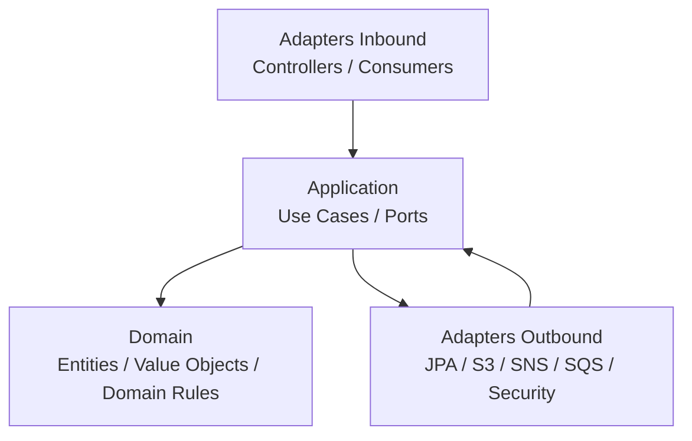

# Shared Architecture LLD

## Objetivo

Definir os padroes comuns de implementacao dos microsservicos da FIAP X Video Processing Platform, preservando as decisoes do HLD.

## Rastreabilidade

| Origem | Aplicacao neste LLD |
|--------|----------------------|
| HLD 06 - Architecture Overview | Microsservicos, Clean Architecture, Hexagonal Architecture e Database per Service. |
| HLD 09 - Event-Driven Architecture | SNS, SQS, eventos VideoUploaded, VideoProcessed e VideoFailed. |
| HLD 11 - Security | JWT, Spring Security, BCrypt, Secrets, IAM minimo e URLs pre-assinadas. |
| HLD 12 - Observability | OpenTelemetry, New Relic, CloudWatch, logs, metricas e traces. |
| HLD 14 - CI-CD | Build, testes, cobertura, SonarQube, Trivy, Docker e deploy. |
| ADR-011 | Microservice Scaffolding and Naming Conventions | Package naming, project structure, Gradle organization. |

## Principios Obrigatorios

- Cada microsservico possui responsabilidade unica.
- Cada microsservico possui banco proprio.
- Nenhum microsservico acessa banco de outro servico.
- Comunicacao assincrona deve ser priorizada.
- Processamento pesado deve ocorrer fora do fluxo sincrono do usuario.
- Controllers nao contem regra de negocio.
- Use cases ficam na camada Application.
- Domain nao depende de frameworks ou infraestrutura.
- Repository concreto pertence a Infrastructure.
- Configuracoes e segredos ficam fora do codigo.

## Camadas



## Organizacao de Pacotes

Padrao recomendado por microsservico (consultar ADR-011 para detalhes):

```text
com.fiapx.<service>
  application
    usecase
    port.in
    port.out
    dto
  domain
    model
    valueobject
    exception
  infrastructure
    adapter.in.web
    adapter.in.messaging
    adapter.out.persistence
    adapter.out.storage
    adapter.out.messaging
    config
  api
    controller
    request
    response
    mapper
  shared
    error
    observability
```

Pacotes nao utilizados por um servico podem ser omitidos sem alterar a arquitetura.

## Padroes de API

- APIs HTTP sao usadas para interacoes iniciadas pelo usuario.
- Recursos protegidos exigem JWT valido.
- DTOs de entrada e saida devem usar records quando apropriado.
- Validacao de entrada deve ocorrer antes dos use cases.
- Erros devem retornar payload consistente e seguro.

## Padrao de Erros HTTP

```json
{
  "timestamp": "2026-01-01T00:00:00Z",
  "status": 400,
  "error": "VALIDATION_ERROR",
  "message": "Invalid request",
  "path": "/api/videos"
}
```

Campos sensiveis, tokens, senhas e credenciais nunca devem aparecer em logs ou respostas.

## Padroes de Eventos

Todos os eventos devem conter envelope minimo:

```json
{
  "eventId": "uuid",
  "eventType": "VideoUploaded",
  "occurredAt": "2026-01-01T00:00:00Z",
  "correlationId": "uuid",
  "producer": "Video Service",
  "payload": {}
}
```

## Idempotencia

Consumidores devem tratar `eventId` e identificadores de negocio para evitar efeitos duplicados. A estrategia minima e registrar eventos processados no banco do proprio servico quando o consumo alterar estado persistente.

## Observabilidade

- Propagar `correlationId` entre HTTP, eventos e logs.
- Registrar publicacao e consumo de eventos.
- Medir latencia de endpoints e tempo de processamento.
- Monitorar tamanho de filas, retries e DLQ.
- Instrumentar aplicacoes com OpenTelemetry.

## Seguranca

- Identity Service emite JWT.
- Video Service valida JWT para recursos protegidos.
- Senhas devem usar BCrypt.
- Segredos devem usar Kubernetes Secrets.
- Acesso AWS deve seguir IAM minimo e IRSA quando aplicavel.
- S3 nao deve possuir bucket publico.
- Downloads devem ser autorizados e temporarios.

## Banco de Dados

| Servico | Banco logico |
|---------|--------------|
| Identity Service | auth_db |
| Video Service | video_db |
| Notification Service | notification_db |
| Processing Worker | Sem ownership de banco de outro dominio; persistencia local apenas se necessaria para idempotencia operacional. |

## Testes

- Unit tests para Domain e Application.
- Integration tests para repositories, consumers, publishers e adapters externos com Testcontainers e LocalStack.
- Evitar testes de getters e setters.
- Priorizar comportamento de negocio e contratos de integracao.

## Consideracoes

Este documento nao substitui os LLDs especificos. Ele define apenas regras comuns para garantir consistencia entre os microsservicos.
