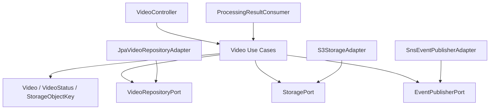
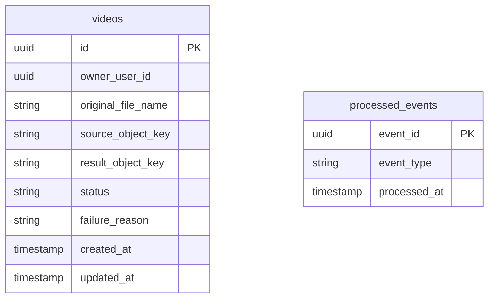
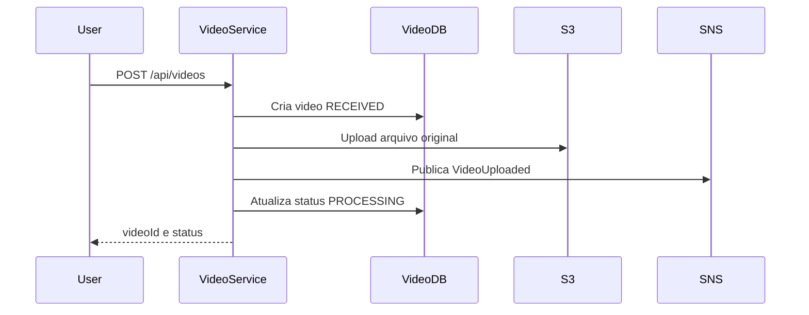

# LLD - Video Service

## Objetivo

Gerenciar o ciclo de vida dos videos enviados pelos usuarios, incluindo upload, persistencia de metadados, publicacao de eventos, consulta de status e disponibilizacao do resultado.

## Rastreabilidade

| Origem | Aplicacao neste LLD |
|--------|----------------------|
| HLD 06 - Architecture Overview | Microservico Video. |
| HLD 09 - Event-Driven Architecture | VideoUploaded, VideoProcessed, VideoFailed. |
| ADR-011 | Convencoes de nomenclatura e organizacao de pacotes. |

## Responsabilidades

- Receber solicitacoes de upload.
- Armazenar arquivos originais no Amazon S3.
- Persistir metadados e status no video_db.
- Publicar VideoUploaded.
- Consumir VideoProcessed e VideoFailed.
- Atualizar status no proprio banco.
- Disponibilizar download autorizado do resultado.

## Limites do Dominio

Pertence ao Video Service:

- Video.
- Status de processamento.
- Referencias para arquivo original e resultado.
- Ownership do video_db.

Nao pertence ao Video Service:

- Autenticacao de credenciais.
- Execucao de FFmpeg.
- Envio efetivo de email.

## Requisitos Atendidos

| Requisito | Atendimento |
|-----------|-------------|
| RF-02 | Upload de videos. |
| RF-03 | Armazenamento em S3. |
| RF-04 | Publicacao para processamento assincrono. |
| RF-05 | Consulta de status. |
| RF-06 | Download do resultado. |
| RF-08 | Publicacao de eventos. |
| RF-10 | Historico de videos. |

## Casos de Uso

| Caso de uso | Descricao |
|-------------|-----------|
| UploadVideo | Recebe arquivo, salva no S3, cria registro e publica VideoUploaded. |
| GetVideoStatus | Consulta status de um video do usuario. |
| ListUserVideos | Lista historico de videos do usuario. |
| GenerateDownloadUrl | Gera acesso temporario ao resultado processado. |
| MarkVideoProcessed | Consome VideoProcessed e atualiza status. |
| MarkVideoFailed | Consome VideoFailed e atualiza status. |

## Arquitetura Interna



## Organizacao dos Pacotes

Consultar ADR-011 para detalhes completos.

```text
com.fiapx.video
  application.usecase
  application.ports.in
  application.ports.out
  domain.model
  domain.valueobject
  domain.exception
  infrastructure.adapter.in.web
  infrastructure.adapter.in.messaging
  infrastructure.adapter.out.persistence
  infrastructure.adapter.out.storage
  infrastructure.adapter.out.messaging
  infrastructure.config
  api.controller
  api.request
  api.response
  api.mapper
  shared.error
```

## Entidades

### Video

| Campo | Tipo | Regra |
|-------|------|-------|
| id | UUID | Identificador do video. |
| ownerUserId | UUID | Usuario proprietario. |
| originalFileName | String | Nome original informado no upload. |
| sourceObjectKey | StorageObjectKey | Chave do arquivo original no S3. |
| resultObjectKey | StorageObjectKey | Chave do ZIP quando processado. |
| status | VideoStatus | RECEIVED, PROCESSING, PROCESSED, FAILED. |
| failureReason | String | Motivo seguro de falha quando houver. |
| createdAt | Instant | Criacao do registro. |
| updatedAt | Instant | Ultima alteracao. |

## Value Objects

| Value Object | Regra |
|--------------|-------|
| VideoStatus | Estados permitidos: RECEIVED, PROCESSING, PROCESSED, FAILED. |
| StorageObjectKey | Chave interna do objeto no S3. |
| FileName | Nome original sanitizado para exibicao. |

## DTOs

| DTO | Campos |
|-----|--------|
| VideoUploadResponse | videoId, status |
| VideoResponse | id, originalFileName, status, createdAt, updatedAt, downloadAvailable |
| VideoStatusResponse | id, status, failureReason |
| DownloadUrlResponse | videoId, url, expiresAt |

## Controllers

| Metodo | Endpoint | Uso |
|--------|----------|-----|
| POST | /api/videos | Upload de video. |
| GET | /api/videos | Historico do usuario autenticado. |
| GET | /api/videos/{videoId} | Detalhe e status. |
| GET | /api/videos/{videoId}/download | URL temporaria para download do ZIP. |

## Use Cases

### UploadVideo

1. Validar usuario autenticado e arquivo.
2. Persistir registro com status RECEIVED.
3. Armazenar arquivo original no S3.
4. Publicar VideoUploaded no SNS.
5. Atualizar status para PROCESSING quando o envio para processamento for confirmado.
6. Retornar videoId e status.

### MarkVideoProcessed

1. Consumir VideoProcessed via SQS.
2. Validar idempotencia do evento.
3. Localizar video no video_db.
4. Atualizar status para PROCESSED e registrar resultObjectKey.

### MarkVideoFailed

1. Consumir VideoFailed via SQS.
2. Validar idempotencia do evento.
3. Localizar video no video_db.
4. Atualizar status para FAILED e registrar motivo seguro.

## Ports

| Port | Direcao | Responsabilidade |
|------|---------|------------------|
| UploadVideoUseCase | Inbound | Upload e publicacao de evento. |
| GetVideoStatusUseCase | Inbound | Consulta de status. |
| ListUserVideosUseCase | Inbound | Historico. |
| GenerateDownloadUrlUseCase | Inbound | Download temporario. |
| ProcessVideoResultUseCase | Inbound | Processar eventos de resultado. |
| VideoRepositoryPort | Outbound | Persistencia de videos. |
| StoragePort | Outbound | Operacoes S3. |
| EventPublisherPort | Outbound | Publicacao SNS. |
| ProcessedEventIdempotencyPort | Outbound | Controle de eventos processados. |

## Adapters

| Adapter | Tipo | Responsabilidade |
|---------|------|------------------|
| VideoController | Inbound HTTP | Expor upload, status, historico e download. |
| ProcessingResultConsumer | Inbound messaging | Consumir VideoProcessed e VideoFailed. |
| JpaVideoRepositoryAdapter | Outbound persistence | Persistir videos. |
| S3StorageAdapter | Outbound storage | Upload e URL pre-assinada. |
| SnsEventPublisherAdapter | Outbound messaging | Publicar VideoUploaded. |

## Repositorios

| Repositorio | Banco | Operacoes |
|-------------|-------|-----------|
| VideoRepository | video_db | save, findByIdAndOwnerUserId, findByOwnerUserId, updateStatus |
| ProcessedEventRepository | video_db | existsByEventId, saveProcessedEvent |

## Eventos Publicados

| Evento | Quando |
|--------|--------|
| VideoUploaded | Apos armazenamento do arquivo original e criacao do registro. |

## Eventos Consumidos

| Evento | Acao |
|--------|------|
| VideoProcessed | Atualiza status para PROCESSED. |
| VideoFailed | Atualiza status para FAILED. |

## Modelo de Dados



## Fluxos

### Upload



## Estrategia de Tratamento de Erros

| Erro | Resposta ou acao |
|------|------------------|
| Token ausente ou invalido | 401 UNAUTHORIZED |
| Arquivo invalido | 400 BAD REQUEST |
| Video nao encontrado para usuario | 404 NOT FOUND |
| Download antes de PROCESSED | 409 CONFLICT |
| Falha ao publicar evento | Registrar erro e nao confirmar fluxo como processavel. |
| Evento duplicado | Ignorar com log de idempotencia. |

## Estrategia de Testes

- Unit tests para transicoes de VideoStatus.
- Unit tests para UploadVideo, MarkVideoProcessed e MarkVideoFailed.
- Integration tests de persistence com Testcontainers.
- Integration tests de S3/SNS/SQS com LocalStack.
- Contract tests dos payloads de eventos.

## Dependencias

- Spring Boot 3.x.
- Spring Security.
- PostgreSQL.
- Flyway.
- Amazon S3.
- Amazon SNS.
- Amazon SQS para consumo de resultado.
- OpenTelemetry.

## Consideracoes

O Video Service e o unico proprietario do dominio Video. O Processing Worker nunca atualiza o video_db diretamente.
