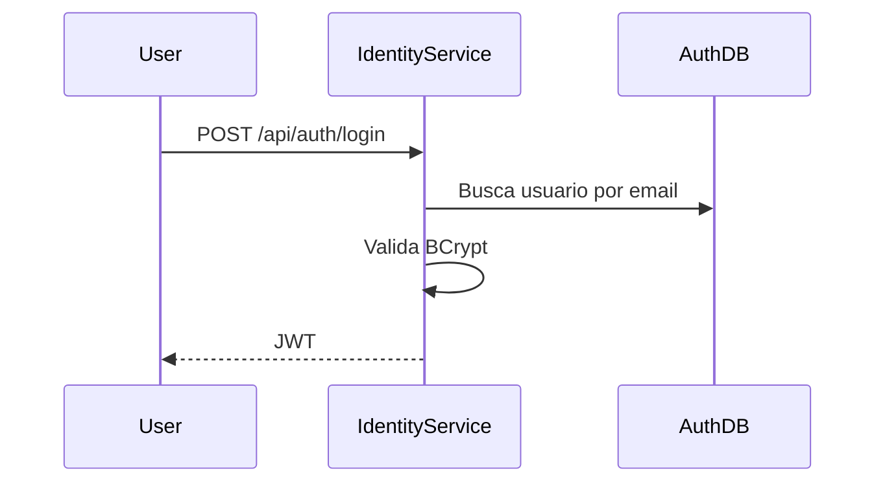

# Authentication API

## Objetivo

Documentar os endpoints HTTP do Identity Service para cadastro, login e consulta do usuario autenticado.

## Base Path

`/api/auth`

## Autenticacao

- `POST /register`, `POST /login` e `POST /refresh` sao publicos.
- `GET /me` e `POST /logout` exigem JWT valido no header `Authorization: Bearer <token>`.

## Endpoints

### POST /api/auth/register

Cria um usuario.

#### Request Body

```json
{
  "name": "User Name",
  "email": "user@example.com",
  "password": "plain-password"
}
```

#### Response 201

```json
{
  "id": "uuid",
  "name": "User Name",
  "email": "user@example.com"
}
```

#### Status Codes

| Status | Motivo |
|--------|--------|
| 201 | Usuario criado. |
| 400 | Entrada invalida. |
| 409 | Email ja cadastrado. |

### POST /api/auth/login

Autentica o usuario e retorna JWT.

#### Request Body

```json
{
  "email": "user@example.com",
  "password": "plain-password"
}
```

#### Response 200

```json
{
  "accessToken": "jwt",
  "tokenType": "Bearer",
  "expiresIn": 3600,
  "refreshToken": "opaque-token"
}
```

#### Status Codes

| Status | Motivo |
|--------|--------|
| 200 | Autenticado. |
| 400 | Entrada invalida. |
| 401 | Credenciais invalidas. |

### POST /api/auth/refresh

Troca um refresh token valido por um novo par access/refresh token (rotacao). O refresh token e um valor opaco (nao JWT), armazenado em `auth_db` apenas como hash, com expiracao e flag `revoked` (ADR-013).

#### Request Body

```json
{
  "refreshToken": "opaque-token"
}
```

#### Response 200

```json
{
  "accessToken": "jwt",
  "tokenType": "Bearer",
  "expiresIn": 3600,
  "refreshToken": "opaque-token"
}
```

#### Status Codes

| Status | Motivo |
|--------|--------|
| 200 | Novo par de tokens emitido. |
| 400 | Entrada invalida. |
| 401 | Refresh token invalido, expirado ou revogado. |

### POST /api/auth/logout

Revoga um refresh token especifico. Requer um access token valido; o access token em si continua stateless (JWT) e nao e revogado - apenas o refresh token informado passa a `revoked=true`.

#### Request Body

```json
{
  "refreshToken": "opaque-token"
}
```

#### Status Codes

| Status | Motivo |
|--------|--------|
| 204 | Refresh token revogado. |
| 400 | Entrada invalida. |
| 401 | Access token ausente ou invalido. |

### GET /api/auth/me

Retorna dados do usuario autenticado.

#### Response 200

```json
{
  "id": "uuid",
  "name": "User Name",
  "email": "user@example.com"
}
```

#### Status Codes

| Status | Motivo |
|--------|--------|
| 200 | Usuario autenticado. |
| 401 | Token ausente ou invalido. |

## Fluxo



## Erros Possiveis

Todas as respostas de erro devem seguir o contrato compartilhado definido em `docs/LLD/shared-architecture.md`.
