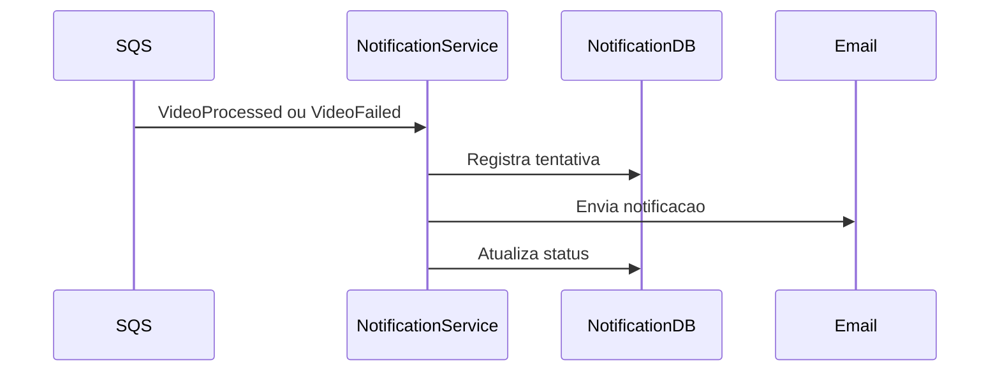

# Notification API

## Objetivo

Documentar a superficie de integracao do Notification Service.

## Contrato Principal

O Notification Service reage a eventos `VideoProcessed` e `VideoFailed` recebidos por Amazon SQS. Seu objetivo primario e enviar notificacoes relacionadas ao processamento.

## Endpoints

Nao existem endpoints HTTP de negocio definidos para o Notification Service no HLD ou na TASK-001.

| Tipo | Contrato |
|------|----------|
| Entrada | SQS com eventos VideoProcessed e VideoFailed. |
| Saida | Envio de notificacao pelo canal configurado. |

## Fluxo

## Erros Possiveis

| Erro | Tratamento |
|------|------------|
| Evento duplicado | Ignorar com idempotencia. |
| Falha temporaria de envio | Retry via SQS. |
| Excedeu tentativas | Encaminhar para DLQ. |
