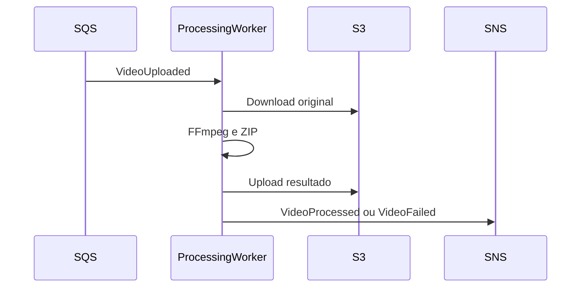

# API de Processamento

## Objetivo

Documentar a superficie de integracao do Processing Worker.

## Contrato Principal

O Processing Worker nao expoe API HTTP de negocio. Sua entrada obrigatoria e o evento `VideoUploaded` recebido por Amazon SQS, e suas saidas obrigatorias sao os eventos `VideoProcessed` e `VideoFailed` publicados no Amazon SNS.

## Endpoints

Nao existem endpoints de negocio definidos para o Processing Worker no HLD ou na TASK-001.

| Tipo | Contrato |
|------|----------|
| Entrada | SQS com evento VideoUploaded. |
| Saida sucesso | SNS com evento VideoProcessed. |
| Saida falha | SNS com evento VideoFailed. |

## Fluxo

## Erros Possiveis

| Erro | Tratamento |
|------|------------|
| Evento duplicado | Ignorar com idempotencia. |
| Falha temporaria em S3 ou SNS | Retry via SQS. |
| Falha de processamento | Publicar VideoFailed. |
| Excedeu tentativas | Encaminhar para DLQ. |

## Observacao

Health checks de plataforma podem existir conforme configuracao operacional do Spring Boot e Kubernetes, mas nao representam API de negocio do Processing Worker.
