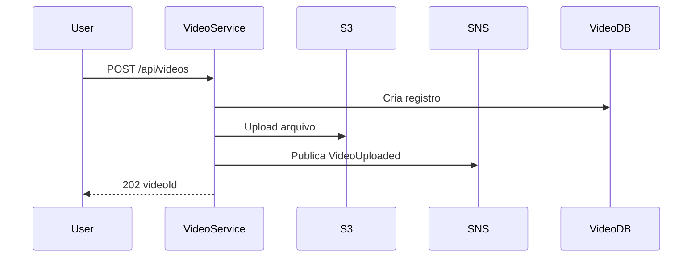

# API de Video

## Objetivo

Documentar os endpoints HTTP do Video Service para upload, consulta, historico e download de resultados.

## Caminho Base

`/api/videos`

## Autenticacao

Todos os endpoints exigem JWT valido.

## Endpoints

### POST /api/videos

Envia um video para processamento assincrono.

#### Requisicao

`multipart/form-data`

| Campo | Tipo | Obrigatorio |
|-------|------|-------------|
| file | binary | Sim |

#### Resposta 202

```json
{
  "videoId": "uuid",
  "status": "PROCESSING"
}
```

#### Codigos de Status

| Status | Motivo |
|--------|--------|
| 202 | Video recebido para processamento. |
| 400 | Arquivo invalido. |
| 401 | Token ausente ou invalido. |
| 500 | Falha nao esperada. |

### GET /api/videos

Lista o historico de videos do usuario autenticado.

#### Parametros de Consulta

| Nome | Tipo | Obrigatorio | Descricao |
|------|------|-------------|-----------|
| status | string | Nao | Filtra por RECEIVED, PROCESSING, PROCESSED ou FAILED. |

#### Resposta 200

```json
[
  {
    "id": "uuid",
    "originalFileName": "video.mp4",
    "status": "PROCESSED",
    "createdAt": "2026-01-01T00:00:00Z",
    "updatedAt": "2026-01-01T00:10:00Z",
    "downloadAvailable": true
  }
]
```

### GET /api/videos/{videoId}

Consulta detalhe e status de um video do usuario autenticado.

#### Parametros de Caminho

| Nome | Tipo | Obrigatorio |
|------|------|-------------|
| videoId | uuid | Sim |

#### Resposta 200

```json
{
  "id": "uuid",
  "originalFileName": "video.mp4",
  "status": "PROCESSING",
  "createdAt": "2026-01-01T00:00:00Z",
  "updatedAt": "2026-01-01T00:01:00Z",
  "downloadAvailable": false
}
```

#### Codigos de Status

| Status | Motivo |
|--------|--------|
| 200 | Video encontrado. |
| 401 | Token ausente ou invalido. |
| 404 | Video inexistente ou nao pertence ao usuario. |

### GET /api/videos/{videoId}/download

Gera URL temporaria para download do ZIP processado.

#### Resposta 200

```json
{
  "videoId": "uuid",
  "url": "https://s3-presigned-url",
  "expiresAt": "2026-01-01T01:00:00Z"
}
```

#### Codigos de Status

| Status | Motivo |
|--------|--------|
| 200 | URL gerada. |
| 401 | Token ausente ou invalido. |
| 404 | Video inexistente ou nao pertence ao usuario. |
| 409 | Resultado ainda nao esta disponivel. |

## Fluxo



## Erros Possiveis

Erros seguem o contrato compartilhado. O Video Service nao deve expor chaves internas do S3, stack traces ou detalhes de infraestrutura.
