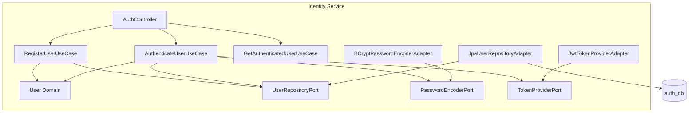

# Component Diagram - Identity Service

## Objetivo

Detalhar os componentes internos do Identity Service.

```mermaid
flowchart TB
  subgraph Identity["Identity Service"]
    Controller["AuthController"]
    Register["RegisterUserUseCase"]
    Login["AuthenticateUserUseCase"]
    Me["GetAuthenticatedUserUseCase"]
    Domain["User Domain"]
    UserRepoPort["UserRepositoryPort"]
    PasswordPort["PasswordEncoderPort"]
    TokenPort["TokenProviderPort"]
    UserRepo["JpaUserRepositoryAdapter"]
    Password["BCryptPasswordEncoderAdapter"]
    Token["JwtTokenProviderAdapter"]
  end

  AuthDB[(auth_db)]

  Controller --> Register
  Controller --> Login
  Controller --> Me
  Register --> Domain
  Login --> Domain
  Register --> UserRepoPort
  Login --> UserRepoPort
  Login --> PasswordPort
  Login --> TokenPort
  UserRepo --> UserRepoPort
  UserRepo --> AuthDB
  Password --> PasswordPort
  Token --> TokenPort
```
