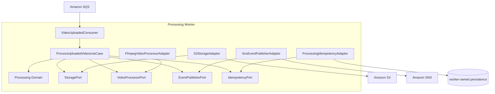

# Component Diagram - Processing Worker

## Objetivo

Detalhar os componentes internos do Processing Worker.

```mermaid
flowchart TB
  subgraph Worker["Processing Worker"]
    Consumer["VideoUploadedConsumer"]
    Process["ProcessUploadedVideoUseCase"]
    Domain["Processing Domain"]
    StoragePort["StoragePort"]
    ProcessorPort["VideoProcessorPort"]
    PublisherPort["EventPublisherPort"]
    IdempotencyPort["IdempotencyPort"]
    S3Adapter["S3StorageAdapter"]
    Ffmpeg["FfmpegVideoProcessorAdapter"]
    SNSAdapter["SnsEventPublisherAdapter"]
    Idempotency["ProcessingIdempotencyAdapter"]
  end

  SQS["Amazon SQS"]
  S3["Amazon S3"]
  SNS["Amazon SNS"]
  WorkerStore[(worker-owned persistence)]

  SQS --> Consumer
  Consumer --> Process
  Process --> Domain
  Process --> StoragePort
  Process --> ProcessorPort
  Process --> PublisherPort
  Process --> IdempotencyPort
  S3Adapter --> StoragePort
  S3Adapter --> S3
  Ffmpeg --> ProcessorPort
  SNSAdapter --> PublisherPort
  SNSAdapter --> SNS
  Idempotency --> IdempotencyPort
  Idempotency --> WorkerStore
```
