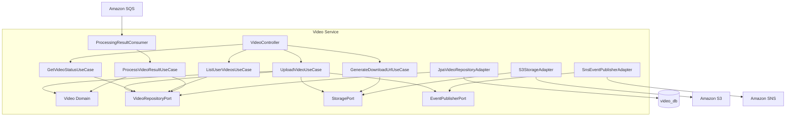

# Diagrama de Componentes - Video Service

## Objetivo

Detalhar os componentes internos do Video Service.

```mermaid
flowchart TB
  subgraph VideoService["Video Service"]
    Controller["VideoController"]
    Consumer["ProcessingResultConsumer"]
    Upload["UploadVideoUseCase"]
    Status["GetVideoStatusUseCase"]
    List["ListUserVideosUseCase"]
    Download["GenerateDownloadUrlUseCase"]
    Result["ProcessVideoResultUseCase"]
    Domain["Video Domain"]
    RepoPort["VideoRepositoryPort"]
    StoragePort["StoragePort"]
    PublisherPort["EventPublisherPort"]
    Repo["JpaVideoRepositoryAdapter"]
    S3["S3StorageAdapter"]
    SNS["SnsEventPublisherAdapter"]
  end

  VideoDB[(video_db)]
  AmazonS3["Amazon S3"]
  AmazonSNS["Amazon SNS"]
  AmazonSQS["Amazon SQS"]

  Controller --> Upload
  Controller --> Status
  Controller --> List
  Controller --> Download
  Consumer --> Result
  AmazonSQS --> Consumer
  Upload --> Domain
  Result --> Domain
  Upload --> RepoPort
  Status --> RepoPort
  List --> RepoPort
  Result --> RepoPort
  Upload --> StoragePort
  Download --> StoragePort
  Upload --> PublisherPort
  Repo --> RepoPort
  Repo --> VideoDB
  S3 --> StoragePort
  S3 --> AmazonS3
  SNS --> PublisherPort
  SNS --> AmazonSNS
```
