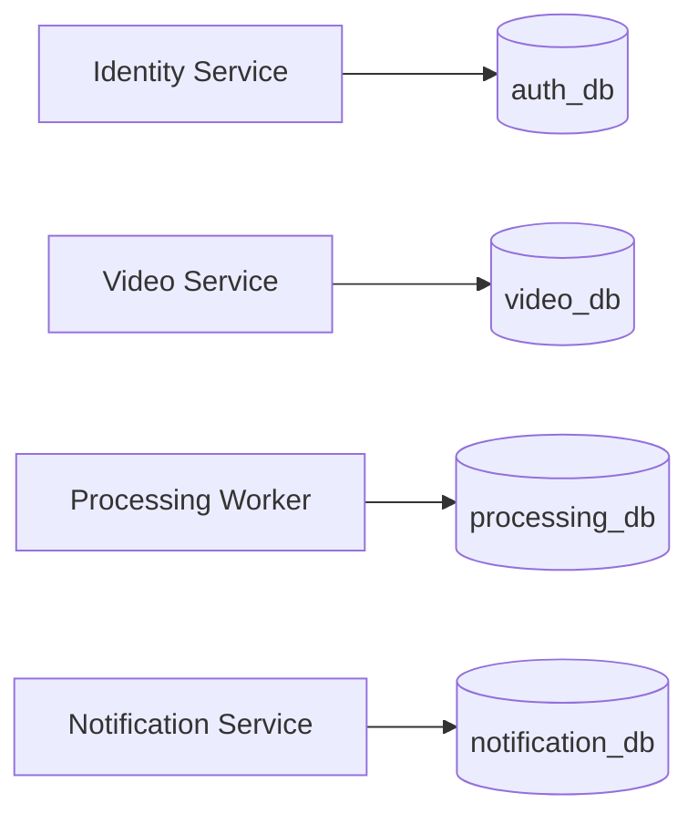
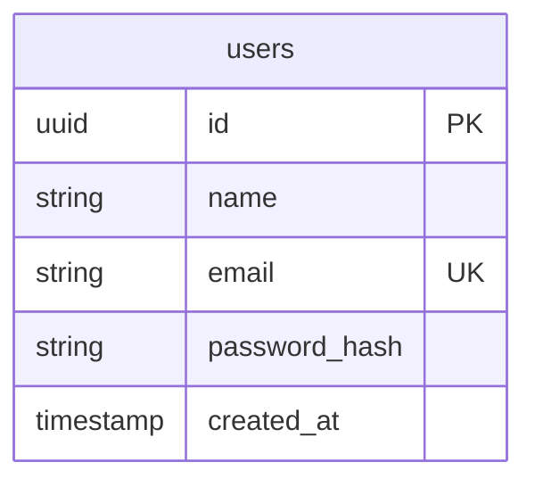
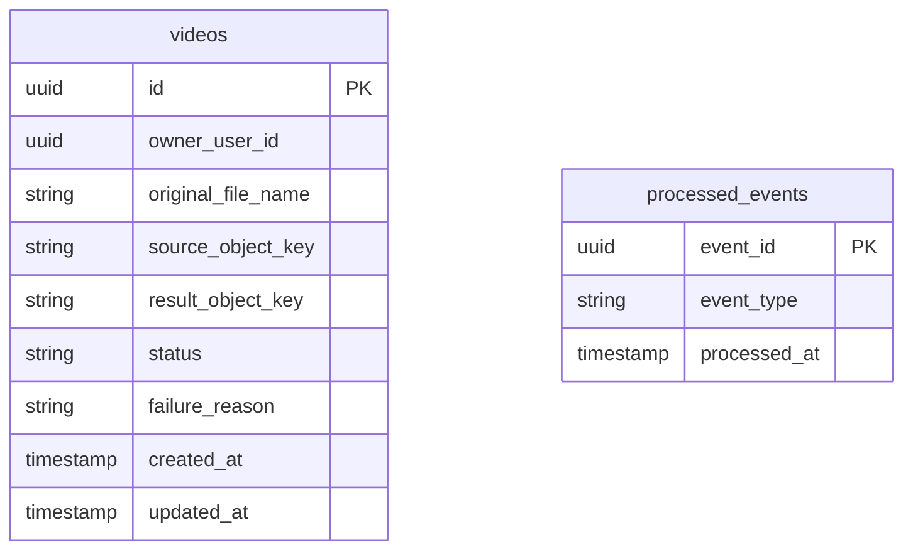
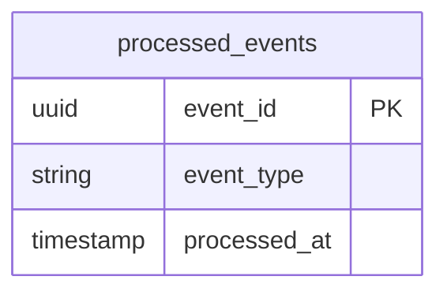
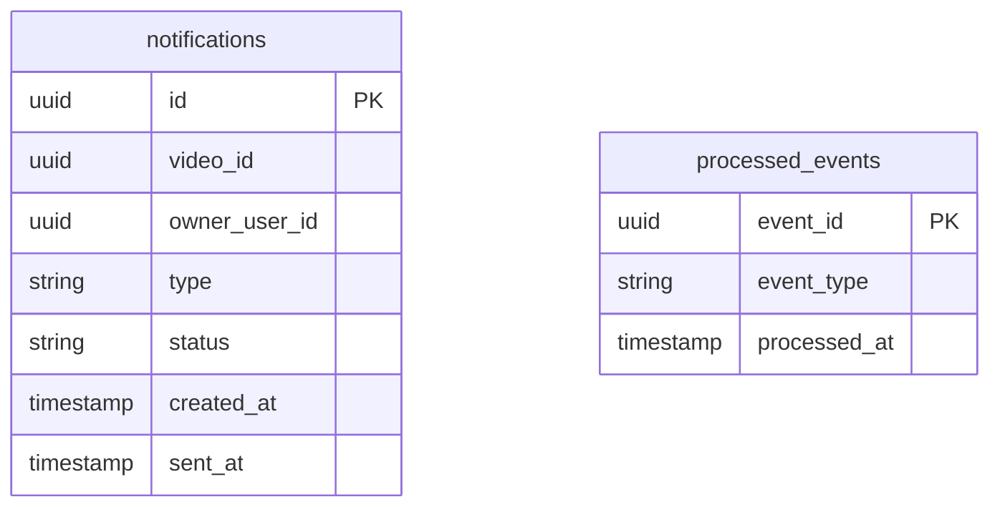

# Database Model

## Objetivo

Representar os modelos de dados por servico, preservando Database per Service.

## Visao Geral

## auth_db

## video_db

## processing_db

## notification_db

## Regras

- Nenhum servico acessa diretamente banco de outro servico.
- O Processing Worker nao atualiza o video_db.
- Flyway deve versionar migracoes por servico.
