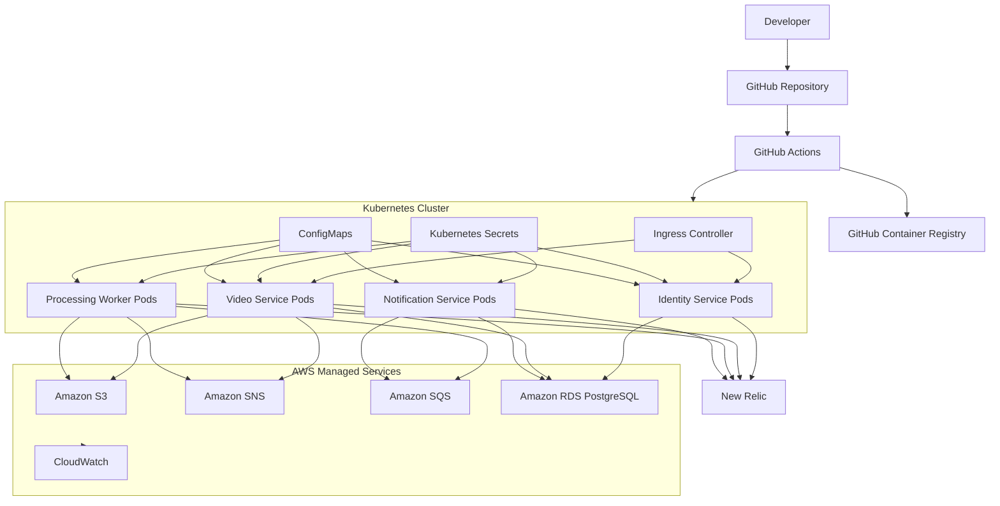

# Diagrama de Implantação - Detalhado

## Objetivo

Detalhar a implantacao da plataforma em Kubernetes e servicos gerenciados AWS.

## Regras

- Cada servico tem imagem e deploy independente.
- Secrets nao devem ser commitados.
- RDS contem bancos logicos separados por servico.
- S3, SNS e SQS sao servicos gerenciados AWS.
