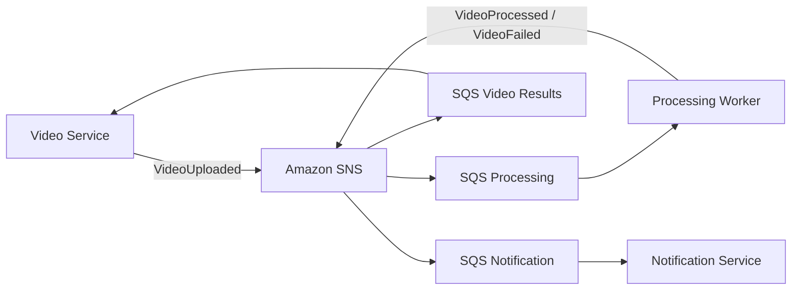

# Event Catalog

## Objetivo

Documentar os eventos da FIAP X Video Processing Platform conforme a arquitetura Event Driven definida no HLD.

## Envelope Padrao

```json
{
  "eventId": "uuid",
  "eventType": "VideoUploaded",
  "occurredAt": "2026-01-01T00:00:00Z",
  "correlationId": "uuid",
  "producer": "Video Service",
  "payload": {}
}
```

## Topologia



## VideoUploaded

### Descricao

Indica que um video foi recebido pelo Video Service, armazenado no Amazon S3 e esta disponivel para processamento.

### Produtor

- Video Service

### Consumidores

- Processing Worker

### Payload

```json
{
  "videoId": "uuid",
  "ownerUserId": "uuid",
  "ownerEmail": "user@example.com",
  "originalFileName": "video.mp4",
  "sourceObjectKey": "videos/original/uuid.mp4"
}
```

### Garantias

- Publicado apos persistencia do video e upload do arquivo original.
- Consumidor deve ser idempotente.
- Entrega pode ocorrer mais de uma vez.

### Retry

Gerenciado por SQS conforme politica da fila de processamento.

### Idempotencia

Processing Worker deve usar `eventId` e `videoId` para evitar processamento duplicado.

### Dead Letter Queue

Mensagens que excederem tentativas devem ser enviadas para DLQ da fila de processamento.

### Observacoes

O evento nao autoriza o Worker a atualizar o video_db.

## VideoProcessed

### Descricao

Indica que o Processing Worker concluiu o processamento e armazenou o ZIP de resultado no S3.

### Produtor

- Processing Worker

### Consumidores

- Video Service
- Notification Service

### Payload

```json
{
  "videoId": "uuid",
  "ownerUserId": "uuid",
  "ownerEmail": "user@example.com",
  "resultObjectKey": "videos/results/uuid.zip",
  "frameCount": 120
}
```

### Garantias

- Publicado somente apos upload do ZIP no S3.
- Video Service e responsavel por atualizar o video_db.
- Notification Service reage sem alterar dados do Video Service.

### Retry

Gerenciado por filas SQS de cada consumidor.

### Idempotencia

Cada consumidor deve registrar `eventId` processado no proprio contexto.

### Dead Letter Queue

Cada fila consumidora deve possuir DLQ propria.

### Observacoes

A consistencia entre resultado no S3 e status no Video Service e eventual.

## VideoFailed

### Descricao

Indica que ocorreu falha no processamento do video.

### Produtor

- Processing Worker

### Consumidores

- Video Service
- Notification Service

### Payload

```json
{
  "videoId": "uuid",
  "ownerUserId": "uuid",
  "ownerEmail": "user@example.com",
  "failureReason": "PROCESSING_ERROR"
}
```

### Garantias

- Publicado quando a falha e conhecida pelo Processing Worker.
- Motivo da falha deve ser seguro, sem stack trace ou dado sensivel.

### Retry

Falhas temporarias devem ser tratadas pela politica de retry da fila. Falhas conhecidas de processamento geram VideoFailed.

### Idempotencia

Video Service deve evitar transicoes duplicadas e Notification Service deve evitar notificacoes duplicadas.

### Dead Letter Queue

Cada fila consumidora deve possuir DLQ propria.

### Observacoes

O status FAILED e persistido exclusivamente pelo Video Service.
