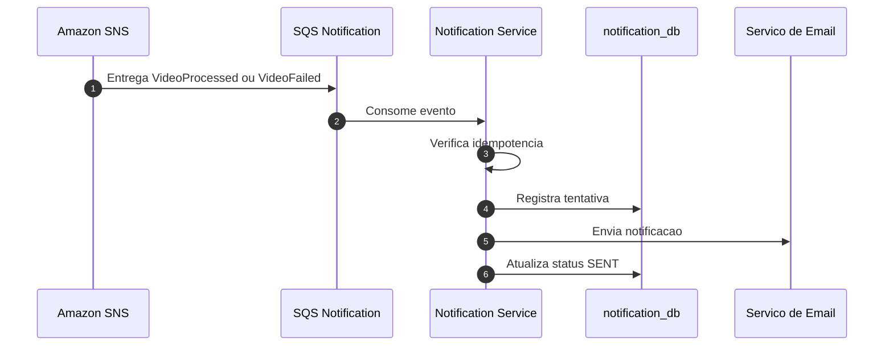

# Diagrama de Sequencia - Notificacao de Processamento

## Objetivo

Representar o fluxo de notificacao baseado em `VideoProcessed` e `VideoFailed`.

## Regras

- Notification Service nao altera video_db.
- Notificacoes duplicadas devem ser evitadas por idempotencia.
- Falhas temporarias devem usar retry da fila.
