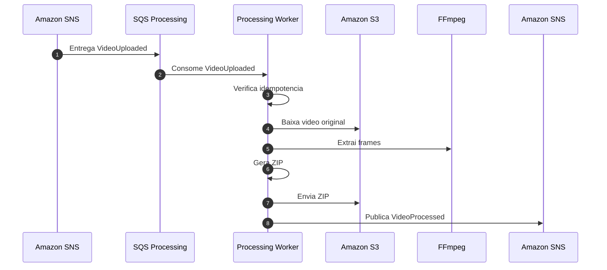
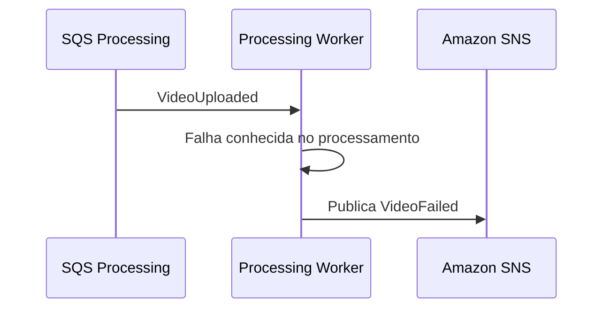

# Diagrama de Sequencia - Processamento de Video

## Objetivo

Representar o processamento assincrono iniciado pelo evento `VideoUploaded`.

## Fluxo de Falha

## Regras

- O Worker nunca atualiza o video_db.
- Retry e DLQ pertencem a fila SQS.
- O resultado retorna ao Video Service por evento.
