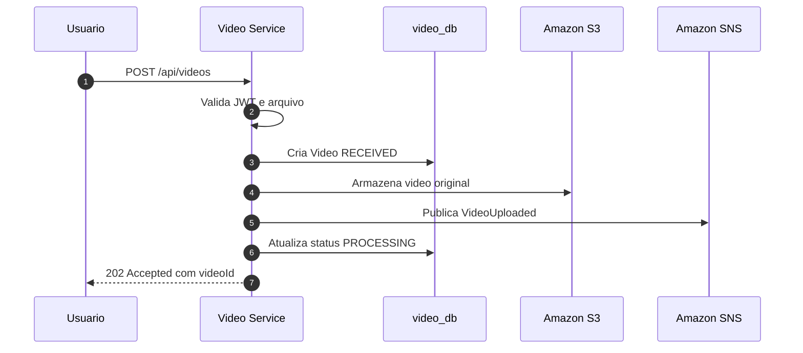

# Sequence - Upload de Video

## Objetivo

Representar o fluxo de upload, armazenamento e publicacao do evento `VideoUploaded`.

## Regras

- O upload nao executa processamento pesado.
- O arquivo original fica no S3.
- O processamento inicia somente por evento.
